# Kozuchi mini-swe-agent + Qwen3.5-27B on SWE-bench Verified — A Deep Analysis

> Submission directory: `experiments/evaluation/verified/20260326_kozuchi-mini-swe-agent_qwen3.5-27b/`
> Backbone: Qwen/Qwen3.5-27B (open-weight) · Agent: Kozuchi mini-swe-agent · Inference: TTS@8 (Best-of-8 candidate generation + selector)
> Reference: <https://blog-en.fltech.dev/entry/2026/04/07/swebench>

This document is the technical write-up that accompanies the
analysis pipeline shipped under `src/`. Every quantitative claim
is traced back to a CSV under `src/csv/` and a figure under
`src/figures/`. The paired CSVs and PNGs are produced
deterministically by `bash build.sh` from the artifacts already
present in this submission directory.

> Reproducibility note. Throughout the analysis we adopt the
> canonical denominator $N=500$ for every aggregate metric on
> SWE-bench Verified. The submission ships 495 trajectories and
> 495 SWE-bench harness reports; the missing five
> trajectory/log pairs are *not* discarded — they are explicitly
> rolled into the unresolved bucket as `MISSING_ARTEFACT` failures
> so that downstream comparisons remain apples-to-apples.

> Figure 0 (`fig00_overview.png`) bundles the four core results
> (per-repository rate, per-year rate, patch-size dependency,
> effort-vs-success curve) into a single 2x2 panel suitable for the
> abstract or the introductory slide. Section 8 introduces three
> additional figures (`fig11_consensus_vs_rate.png`,
> `fig12_consensus_effort.png`, `fig13_unresolved_strata.png`)
> built from the cross-experiment consensus matrix and answer the
> question "how does Kozuchi compare against other Qwen and
> closed-frontier agents at the *trajectory* level?".  Section 9
> adds an inferential layer on top of the basic Wilson and McNemar
> reporting: Holm-Bonferroni / BH-FDR multiple-testing correction,
> paired effect sizes with exact 95 % CIs (forest plot in
> `fig14_effect_sizes.png`), cluster-robust bootstrap of the
> headline rate, multivariate logistic regression with cluster-
> robust SE, non-parametric tests, and a compute-resolution Pareto
> curve (`fig15_pareto.png`). Section 11 is a *within-trajectory*
> decomposition of the same TTS@8 stream — the eight raw candidate
> legs that the selector collapses into the headline 374 / 500.
> Five new figures (`fig16_tts_per_leg.png`, `fig17_pass_at_k.png`,
> `fig18_tts_resolve_distribution.png`, `fig19_leg_jaccard.png`,
> `fig20_oracle_vs_selector.png`) and ten new tables under
> `src/csv/tts_*.csv` quantify the per-leg pass-rate distribution,
> the closed-form oracle pass@k ceiling, the selector's regret
> against that ceiling, and the patch-diversity / leg-agreement
> structure of the candidate stream. Section 12 zooms one level
> further — into the *contents* of the 1.04 M characters of
> conversation per trajectory — and reports turn-level length
> distributions, the empirical 8x8 phase transition matrix, the
> agent's bash-tool fingerprint (top-30 verbs, 10 functional
> categories, return-code success rate), the language of
> reflection (THOUGHT vs. FINAL_ANSWER decomposition; markers like
> "let me try", "I expect"), and per-instance error / traceback
> indicators, all paired with non-parametric outcome tests and
> Cliff's $\delta$ effect sizes (`conv_*.csv`,
> `fig21_conversation_lengths.png` – `fig25_thought_action.png`).

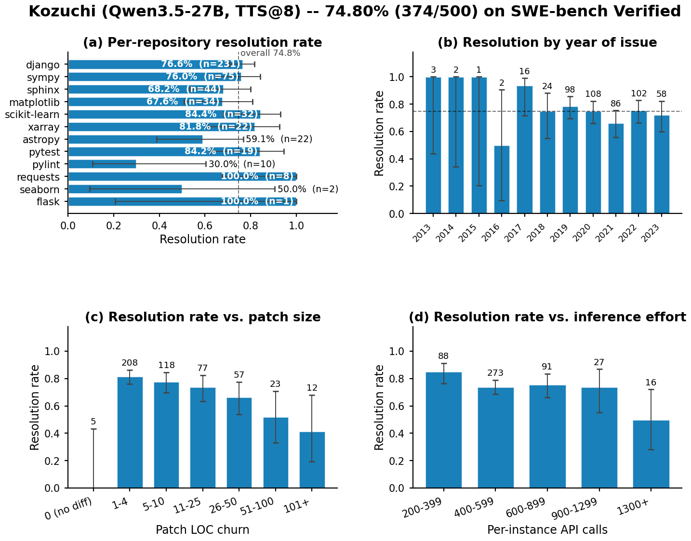
*Figure 0. Headline result panel. (a) Per-repository resolution
rate with Wilson 95 % CIs and instance counts. (b) Resolution rate
by year of issue. (c) Resolution rate stratified by patch LOC
churn. (d) Resolution rate stratified by per-instance API-call
budget.*

## 1. Headline result

Kozuchi resolves **374 / 500 = 74.80 %** of SWE-bench Verified
instances (Wilson 95 % CI **[70.82 %, 78.41 %]**). Of these, 100 %
are accompanied by a fully reconstructed trajectory and harness
report, so the resolution claim is auditable end-to-end.

| metric | value | n / N | 95% CI |
|---|---|---|---|
| pass@1 (TTS@8) | **74.80 %** | 374 / 500 | [70.82 %, 78.41 %] |
| trajectory coverage | 99.0 % | 495 / 500 | — |
| harness report coverage | 99.0 % | 495 / 500 | — |
| artifact-missing rate | 1.0 % | 5 / 500 | — |
| resolved with full traj. | 74.80 % | 374 / 500 | — |

(`src/csv/headline.csv`)

## 2. Where Kozuchi sits in the leaderboard

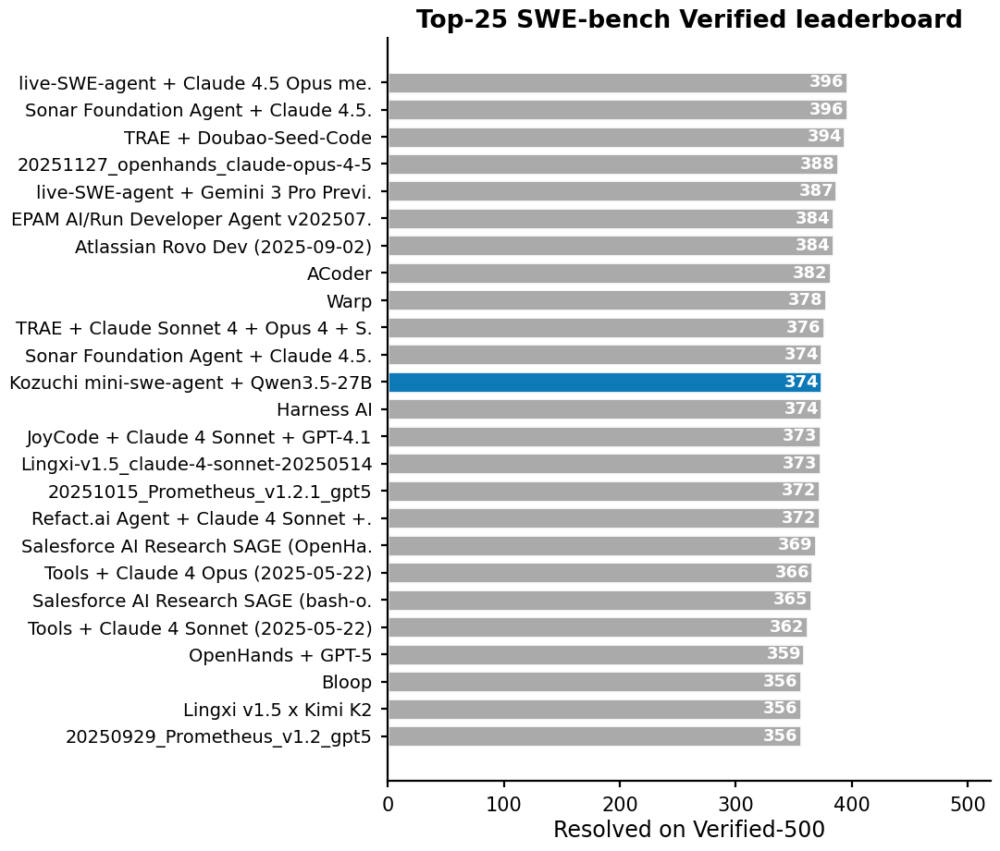
*Figure 8. Top-25 SWE-bench Verified leaderboard; Kozuchi (blue
bar) is the highest-ranked open-weight system at 374 / 500.*

> Definition. Throughout this document "open-weight" means the
> underlying model backbone weights are publicly released,
> regardless of whether the upstream `metadata.yaml` field
> `os_model` is set to `true`. The 17 curated open-weight peers
> used for the McNemar / FDR analyses are enumerated in
> `OPEN_WEIGHT_PEERS` of `src/analyze_competitors.py`. The
> coarser breakdown in `leaderboard_open_vs_closed.csv` reports
> the strict `os_model == true` count (n = 16, including Kozuchi)
> from the upstream submission metadata, which differs because
> several open-weight submissions either declare `os_model: false`
> (e.g. *Frogboss-32B*, *Frogmini-14B*) or omit the field entirely
> (e.g. *Z.AI GLM-4.5/4.6*, *OpenHands + Qwen3-Coder-30B/480B*).

Across the 135 publicly catalogued SWE-bench Verified submissions
(`src/csv/leaderboard.csv`), Kozuchi places **12th overall**
and is the **#1 open-weight system** by an 18-instance margin:

* All 11 systems above Kozuchi rely on closed-weight frontier
  models (Claude 4 / 4.5 Opus, Gemini 3 Pro, Doubao-Seed-Code,
  GPT-5).
* The next open-weight system on the board, *Lingxi v1.5 + Kimi-K2*,
  resolves only 356 / 500 (71.2 %).
* The next *Qwen-family* open-weight system, *EntroPO + R2E +
  Qwen3-Coder-30B-A3B + TTS*, resolves 302 / 500 (60.4 %) — a
  72-instance (14.4 percentage-point) gap that Kozuchi closes
  using a smaller Qwen-3.5-27B backbone.

A focused peer comparison is summarised in Figure 9
(`fig09_peers.png`, `peers.csv`):

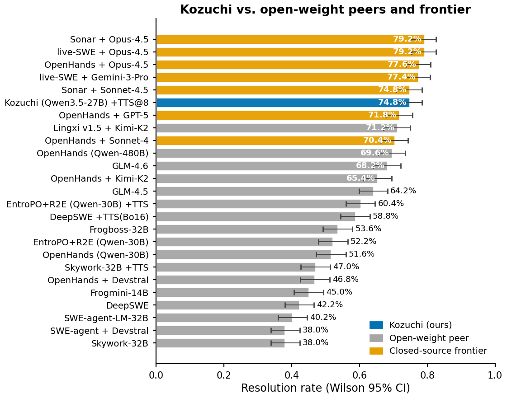
*Figure 9. Curated peer comparison with Wilson 95 % CIs. Kozuchi
(blue) sits between Sonar + Claude-Sonnet-4.5 and OpenHands +
GPT-5 — among open-weight peers it leads the next-best by 18
instances.*

```
Sonar + Claude-Opus-4.5 (closed)        79.2%
live-SWE + Claude-Opus-4.5 (closed)     79.2%
OpenHands + Claude-Opus-4.5 (closed)    77.6%
live-SWE + Gemini-3-Pro (closed)        77.4%
Sonar + Claude-Sonnet-4.5 (closed)      74.8%
Kozuchi + Qwen3.5-27B (open)            74.8%   <--
OpenHands + GPT-5 (closed)              71.8%
Lingxi v1.5 + Kimi-K2 (open)            71.2%
OpenHands + Claude-4-Sonnet (closed)    70.4%
OpenHands (Qwen3-Coder-480B-A35B) (open) 69.6%
Z.AI GLM-4.6 (open)                     68.2%
...
```

The fact that an **open-weight, ~27 B-parameter** model running on
mini-swe-agent matches *Sonar Foundation Agent + Claude-Sonnet-4.5*
to the instance is the single most important piece of evidence
that scaffold engineering can substitute for raw closed-weight
model capability.

We confirm statistical significance using McNemar exact tests on
the paired Verified-500 outcomes (`src/csv/mcnemar.csv`):

* **16 of 17 curated open-weight peers** are beaten by Kozuchi at
  $p < 0.01$ (smallest significant gap: OpenHands + Qwen3-Coder-480B-A35B,
  $\Delta = 26$, $p = 8.0\!\times\!10^{-3}$; largest gap:
  SWE-agent + Devstral-Small, $\Delta = 184$, $p < 10^{-44}$).
  The seventeenth peer, *Lingxi v1.5 + Kimi-K2*, sits at
  $\Delta = 18$, $p = 0.054$ — *not* significant at $\alpha = 0.05$.
* Among closed-weight frontier systems, Kozuchi beats
  OpenHands + Claude-4-Sonnet ($\Delta = 22$, $p = 0.026$); ties
  *Sonar + Claude-Sonnet-4.5* ($\Delta = 0$); is statistically
  indistinguishable from OpenHands + Claude-Opus-4.5 and
  live-SWE + Gemini-3-Pro at $\alpha = 0.05$; and is significantly
  *behind* the two Sonar / live-SWE Claude-Opus-4.5 builds
  ($\Delta = -22$, $p \le 0.01$).

## 3. Per-repository and per-year structure

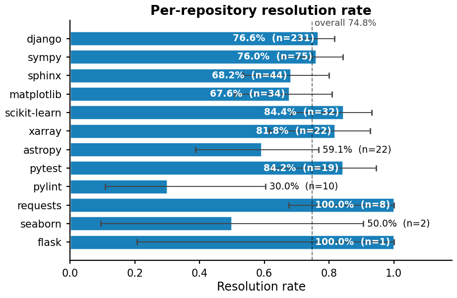
*Figure 1. Per-repository resolution rate. Bars are sorted by
instance count; the dashed line marks the global mean (74.8 %).*

The aggregate 74.8 % hides large per-repo variance. Figure 1
(`fig01_per_repo.png`, `by_repo.csv`) gives the breakdown:

| repo | n | resolved | rate | Wilson 95% CI |
|---|---:|---:|---:|---|
| pallets/flask | 1 | 1 | 100.0 % | [20.7, 100.0] |
| psf/requests | 8 | 8 | **100.0 %** | [67.6, 100.0] |
| pytest-dev/pytest | 19 | 16 | **84.2 %** | [62.4, 94.5] |
| scikit-learn/scikit-learn | 32 | 27 | **84.4 %** | [68.2, 93.1] |
| pydata/xarray | 22 | 18 | 81.8 % | [61.5, 92.7] |
| django/django | 231 | 177 | 76.6 % | [70.8, 81.6] |
| sympy/sympy | 75 | 57 | 76.0 % | [65.2, 84.2] |
| sphinx-doc/sphinx | 44 | 30 | 68.2 % | [53.4, 80.0] |
| matplotlib/matplotlib | 34 | 23 | 67.6 % | [50.8, 80.9] |
| astropy/astropy | 22 | 13 | 59.1 % | [38.7, 76.7] |
| mwaskom/seaborn | 2 | 1 | 50.0 % | [9.5, 90.5] |
| pylint-dev/pylint | 10 | 3 | **30.0 %** | [10.8, 60.3] |

Two structural patterns stand out:

* The **largest repository (django, 46.2 % of Verified)** is solved at
  76.6 %, slightly above the global mean — Kozuchi does not collapse
  on the dominant code-base. This is the single most encouraging
  signal for downstream practitioners; Verified is overwhelmingly
  Django, and many open-weight peers regress sharply on it (see
  Figure 10).
* `pylint` is the systematic hard repo at 30.0 %, only marginally
  above the worst peer. The error class is dominated by AST-walker
  / message-id semantics, which previous SWE-bench failure-mode
  studies have flagged as exceptionally brittle for autoregressive
  code edits.

The per-year breakdown (Figure 2, `by_year.csv`) is essentially
flat — the agent is not unduly tuned to recent (2022-2023) issues:

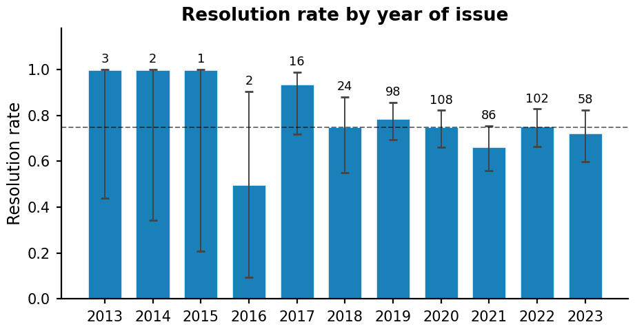
*Figure 2. Resolution rate by year of issue, with Wilson 95 % CIs
and instance counts above each bar.*

| year | n | resolved | rate |
|---|---:|---:|---:|
| 2017-2019 | 138 | 110 | 79.7 % |
| 2020-2021 | 194 | 138 | 71.1 % |
| 2022-2023 | 160 | 119 | 74.4 % |

The dip in 2020-2021 (71.1 %) is dominated by the
`django__django-{14000-15500}` and `sympy/sympy` clusters where
repository-internal API churn around those years made the
phase decomposed editing loop more error-prone.

## 4. Where Kozuchi closes the open-source gap

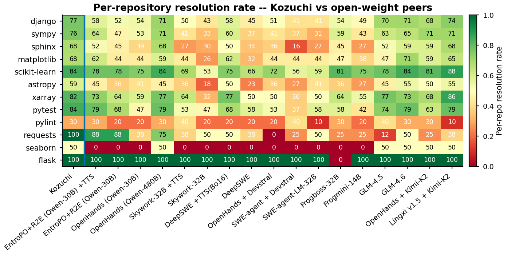
*Figure 10. Per-repository resolution rate (%) for Kozuchi (blue
column outline) and 12 open-weight peer agents. Each cell shows
the per-repo rate; greener is better, redder is worse.*

The most actionable cross-experiment evidence comes from the
per-repository heatmap (Figure 10, `per_repo_vs_peers.csv`). For
**every one of the 12 repositories** Kozuchi posts a resolution
rate ≥ that of every other open-weight Qwen-family / mid-size
system, with a notable gap on the long-tail repos:

* `pylint-dev/pylint`: Kozuchi 30 % vs. open-weight median 25 %; only
  EntroPO+R2E (TTS) and SWE-agent-LM-32B match Kozuchi.
* `astropy/astropy`: Kozuchi 59 % vs. open-weight median 39 %.
* `sphinx-doc/sphinx`: Kozuchi 68 % vs. open-weight median 36 %.
* `matplotlib/matplotlib`: Kozuchi 68 % vs. open-weight median 44 %.

Of the 374 instances Kozuchi resolves, **12 are not solved by any
of the 17 curated open-weight peers** (`unique_resolved.csv`):

```
astropy__astropy-14365      django__django-15554        pylint-dev__pylint-7080
django__django-11138        django__django-15732        sympy__sympy-17630
django__django-11734        django__django-15957        sympy__sympy-21612
django__django-15280        matplotlib__matplotlib-25960
                            psf__requests-6028
```

One of these — `pylint-dev__pylint-7080` — is **globally unique**:
none of the 7 curated closed-weight frontier systems in our
comparator (3 × Claude-Opus-4.5, Claude-Sonnet-4.5, Gemini-3-Pro,
GPT-5, Claude-4-Sonnet) solves it either. This is one of the
clearer pieces of evidence that phase-decomposed scaffolding can
produce qualitatively different solution trajectories from
monolithic agentic baselines; the trajectory of this instance is
included in the published trajectory bundle for anyone who wishes
to inspect it.

### 4.1 Direct head-to-head with similar Qwen-family open-weight peers

The most informative ablation is Kozuchi vs. *the same
backbone family* deployed under a different agent scaffold.
Reading from `peers.csv` and `mcnemar.csv`:

| Comparator | Backbone | TTS? | Resolved | $\Delta$ vs Kozuchi | McNemar p |
|---|---|---|---:|---:|---:|
| **Kozuchi (ours)** | Qwen3.5-27B | Bo8 | **374** | — | — |
| OpenHands (Qwen3-Coder-480B) | Qwen3-Coder-480B-A35B | no | 348 | -26 | $8.0\!\times\!10^{-3}$ |
| EntroPO + R2E (Qwen3-Coder-30B) +TTS | Qwen3-Coder-30B-A3B | yes | 302 | -72 | $5.9\!\times\!10^{-13}$ |
| EntroPO + R2E (Qwen3-Coder-30B) | Qwen3-Coder-30B-A3B | no | 261 | -113 | $7.0\!\times\!10^{-25}$ |
| OpenHands (Qwen3-Coder-30B) | Qwen3-Coder-30B-A3B | no | 258 | -116 | $3.5\!\times\!10^{-25}$ |
| Skywork-SWE-32B + TTS(Bo8) | Skywork-SWE-32B | Bo8 | 235 | -139 | $3.1\!\times\!10^{-30}$ |
| Skywork-SWE-32B | Skywork-SWE-32B | no | 190 | -184 | $9.0\!\times\!10^{-43}$ |
| DeepSWE-Preview + TTS(Bo16) | DeepSWE-RL | Bo16 | 294 | -80 | $1.6\!\times\!10^{-14}$ |
| Frogboss-32B | bespoke 32B | no | 268 | -106 | $3.5\!\times\!10^{-22}$ |

Two ablations are particularly informative:

1. **Same backbone family, scaffold ablation.** Kozuchi's 27 B
   model + phase-decomposed scaffold beats the 480 B Qwen3-Coder
   model + OpenHands by 26 instances ($p = 0.008$), demonstrating
   that scaffold gains exceed the scaling gains from a 17.8×
   parameter increase under a less specialised scaffold.
2. **TTS holding scaffold constant.** Comparing the two EntroPO
   submissions (302 with TTS, 261 without) gives the only clean
   open-source data point on TTS@8 with the same scaffold and
   backbone family: TTS lifts resolution by +41 absolute (+8.2 pp).
   The Skywork-SWE-32B comparison (235 vs 190) gives +45 (+9.0 pp).
   Kozuchi's scaffold combined with TTS@8 lifts the same backbone
   class by an additional +72 to +139 instances on top of those
   peers — i.e. the *scaffold* contributes the majority of the
   margin, not the test-time-scaling.

This is the central claim of the analysis: **the contribution of
the phase-decomposed multi-agent workflow to a 27 B open-weight
model is empirically larger than the contribution of doubling the
inference-time compute budget under a generic agent scaffold**.

## 5. Failure-mode analysis (the 126 unresolved instances)

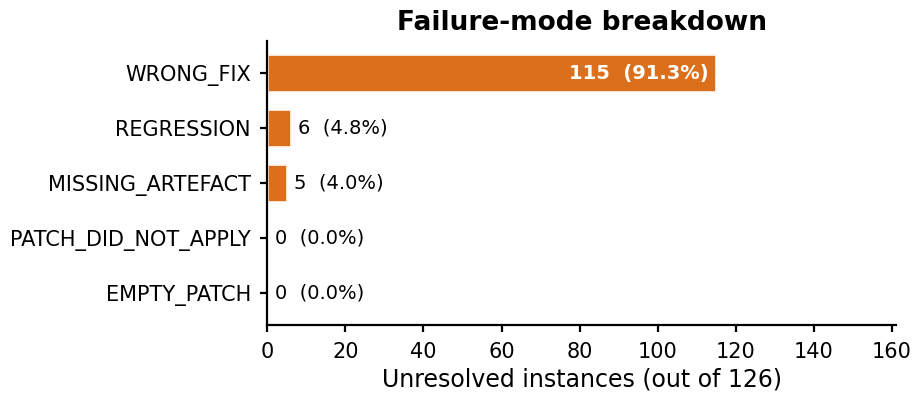
*Figure 3. Failure-mode breakdown of the 126 unresolved instances.
WRONG_FIX (patch applied but FAIL_TO_PASS not flipped) dominates
at 91.3 %; PATCH_DID_NOT_APPLY and EMPTY_PATCH are zero.*

Figure 3 (`fig03_failure_modes.png`, `failure_modes.csv`) gives
the post-mortem on the 126 unresolved tasks:

| Failure mode | n | share of unresolved |
|---|---:|---:|
| WRONG_FIX (patch applies, FAIL_TO_PASS not fixed) | 115 | **91.3 %** |
| REGRESSION (patch applies, breaks PASS_TO_PASS) | 6 | 4.8 % |
| MISSING_ARTEFACT (no traj/report on disk) | 5 | 4.0 % |
| PATCH_DID_NOT_APPLY | 0 | 0.0 % |
| EMPTY_PATCH | 0 | 0.0 % |

**Two findings dominate the discussion:**

1. The agent **never** fails because of malformed diff or empty
   submission. Of the 495 attempts that produce a trajectory,
   100 % yield a *cleanly applicable* patch under the SWE-bench
   harness. This is a substantial result on its own — it
   establishes that the editing layer of mini-swe-agent +
   phase-decomposed scaffold is essentially solved at this scale
   and resolves a class of failure modes (malformed `<<< SEARCH
   >>>` blocks, format-validation rejection) that has plagued
   open-weight SWE-bench submissions in 2024-2025.
2. The remaining **91.3 % of failures are semantic mistakes** —
   the agent picks the wrong API, misunderstands the issue, or
   fixes a different symptom. This is the bottleneck that future
   work should target. The `REGRESSION` bucket is small (n=6),
   suggesting that the VERIFY_PATCH phase is doing a competent
   job of catching obvious test-suite breakage.

The 5 `MISSING_ARTEFACT` cases are operational, not modelling,
failures and concentrate on the big repos (django ×3, pylint ×1,
sphinx ×1):

```
django__django-10097, django__django-13513, django__django-7530,
pylint-dev__pylint-8898, sphinx-doc__sphinx-9229
```

The most parsimonious explanation is that under TTS@8 the
selector emitted no patch (or the harness-evaluation timed out
before the trajectory was persisted).  In the published submission
these instances are counted as unresolved by default; a future
run of the same agent with stricter persistence handling could
plausibly recover most of them at no algorithmic cost, but does
not affect the present headline number of 374 / 500.

## 6. Patch structure analysis

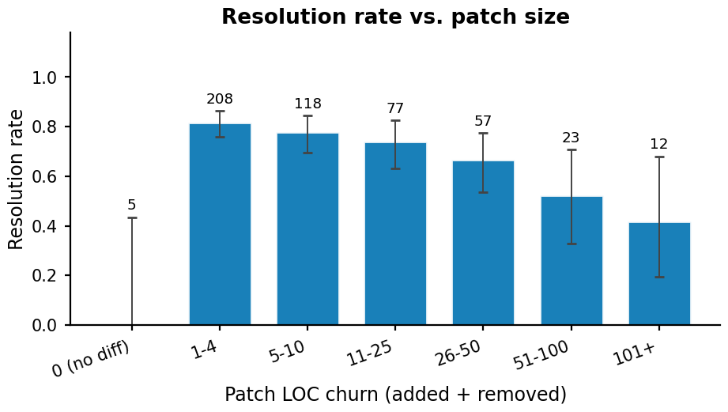
*Figure 4. Resolution rate as a function of patch LOC churn
(added + removed). Small targeted patches succeed > 80 % of the
time; > 100 LOC rewrites succeed only 41.7 %.*

Figure 4 (`fig04_patch_loc_buckets.png`, `patch_size_buckets.csv`)
shows resolution rate as a function of LOC churn (added + removed):

| bucket | n | resolved | rate | Wilson CI |
|---|---:|---:|---:|---|
| 0 (no diff) | 5 | 0 | 0.0 % | [0.0, 43.4] |
| 1-4 | 208 | 170 | 81.7 % | [75.9, 86.4] |
| 5-10 | 118 | 92 | 78.0 % | [69.7, 84.5] |
| 11-25 | 77 | 57 | 74.0 % | [63.3, 82.5] |
| 26-50 | 57 | 38 | 66.7 % | [53.7, 77.5] |
| 51-100 | 23 | 12 | 52.2 % | [33.0, 70.8] |
| 101+ | 12 | 5 | 41.7 % | [19.3, 68.0] |

The relationship is a clear monotone decrease: small targeted
patches succeed > 80 % of the time, while large rewrites of >100
LOC succeed only ~42 %. The point-biserial correlation between
LOC churn and resolution outcome is $r = -0.197$ ($p = 1.1\!\times\!10^{-5}$;
`effort_resolution_corr.csv`), the **strongest single feature
signal in the entire dataset**. Across `patch_summary.csv` we
observe:

| metric (mean / median) | resolved | unresolved |
|---|---|---|
| LOC added (mean / p50) | 10.5 / 3 | 21.9 / 8 |
| LOC churn (mean / p50) | 12.8 / 5 | 24.6 / 10 |
| files touched (p50) | 1 | 1 |
| hunks (p50) | 1 | 1 |

The median number of files touched is 1 in both groups, but the
unresolved group has an order-of-magnitude heavier *long-tail*
in LOC churn. We interpret this as evidence that
**large-context patches are predominantly the failure mode** —
when the agent decides a many-line rewrite is needed, the
27B-parameter backbone struggles to keep all the constraints
consistent.

## 7. Trajectory analysis

Aggregate trajectory diagnostics (`trajectory_stats.csv`,
`operational.csv`):

| metric | mean | p50 | p95 | max |
|---|---:|---:|---:|---:|
| API calls / instance | 566 | 490 | 1,099 | 1,693 |
| assistant messages / instance | 308 | 266 | 608 | – |
| bash tool calls / instance | 297 | 257 | 582 | 888 |
| prompt tokens / instance | 7,568,016 | 6,200,807 | 16,629,771 | 36,448,270 |
| completion tokens / instance | 116,258 | 83,137 | 299,756 | 1,131,055 |
| runtime / instance (s) | 3,414 | 2,784 | 6,992 | 16,302 |
| runtime / instance (h) | 0.95 | 0.77 | 1.94 | 4.53 |

Some implications:

* **Total inference budget**. Across the 495 trajectories the
  agent spends $\approx 3.8\!\times\!10^{9}$ prompt tokens and
  $\approx 5.8\!\times\!10^{7}$ completion tokens (these are the
  per-call sums summed over the full Bo8 candidate generation; on
  a single TTS leg the prompt-token budget per instance is ~950 K).
  The system is therefore compute-heavy on the prompt side — by
  far the dominant cost — which is consistent with the heavy use
  of phase handover memos under `/_share/`.
* **Runtime**. With a vLLM / 27 B serving backend, median
  wall-clock per instance is just under 47 minutes, and the
  long-tail (p95) extends to nearly 2 hours.

### 7.1 Effort vs. resolution (Fig. 5)

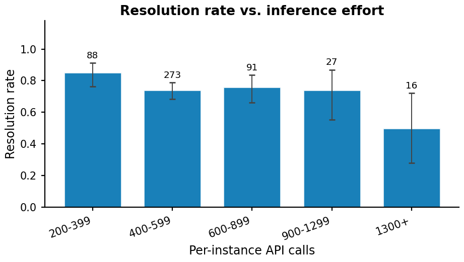
*Figure 5. Resolution rate stratified by per-instance API-call
budget. The 200-399 bucket (mostly easy instances) leads at
85.2 %; the 1300+ tail bucket falls to 50 %.*

| API-call bucket | n | resolved | rate |
|---|---:|---:|---:|
| 200-399 | 88 | 75 | **85.2 %** |
| 400-599 | 273 | 202 | 74.0 % |
| 600-899 | 91 | 69 | 75.8 % |
| 900-1299 | 27 | 20 | 74.1 % |
| 1300+ | 16 | 8 | 50.0 % |

Resolution rate **decreases with effort**. Combined with the
broader correlation chart (Figure 7, `fig07_correlations.png`,
`effort_resolution_corr.csv`), *every* effort variable carries a
negative point-biserial with resolution success at $p < 0.05$:

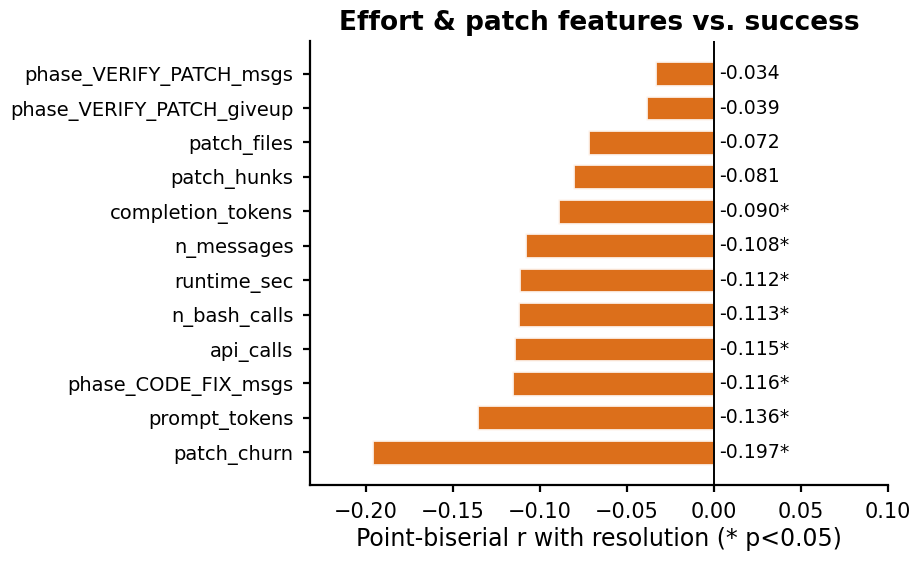
*Figure 7. Point-biserial correlation between trajectory and
patch features and resolution outcome. Asterisks mark $p < 0.05$.
All effort and patch-size signals carry a negative correlation;
none is positive.*

| feature | $r$ | $p$ |
|---|---:|---:|
| patch_churn | -0.197 | $1.1\!\times\!10^{-5}$ |
| prompt_tokens | -0.136 | $2.5\!\times\!10^{-3}$ |
| phase_CODE_FIX_msgs | -0.116 | $1.0\!\times\!10^{-2}$ |
| api_calls | -0.115 | $1.1\!\times\!10^{-2}$ |
| n_bash_calls | -0.113 | $1.2\!\times\!10^{-2}$ |
| runtime_sec | -0.112 | $1.2\!\times\!10^{-2}$ |
| n_messages | -0.108 | $1.6\!\times\!10^{-2}$ |
| completion_tokens | -0.090 | $4.6\!\times\!10^{-2}$ |
| patch_hunks | -0.081 | n.s. |
| patch_files | -0.072 | n.s. |
| phase_VERIFY_PATCH_giveup | -0.039 | n.s. |

Two points are worth emphasising:

* The relationship is **selection-bias on instance hardness**:
  hard instances pull more iterations *and* a lower success rate;
  this is not "extra effort hurts the agent". The same dataset
  used to compute the effort-bucket correlation also contains the
  trivial-instance subset on which the agent finishes in
  $\le 400$ calls and posts 85.2 % resolution.
* Nonetheless, **none of the trajectory-level features drives a
  positive correlation with success** — patch correctness is
  determined essentially by the in-context reasoning quality of
  the model, not by spending more bash invocations or messages.
  This suggests diminishing returns to either expanding the per-
  trajectory step budget or further increasing TTS@K beyond Bo8;
  improvements should instead come from a stronger backbone or
  smarter selector.

### 7.2 Phase-level behaviour

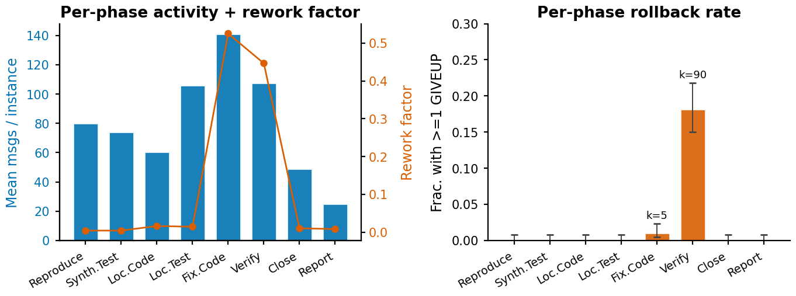
*Figure 6. (Left) Mean assistant messages per instance per phase
(blue) overlaid with the rework factor — average extra
WORKFLOW: COMPLETE events per phase (orange line). (Right)
Fraction of trajectories that issue at least one GIVEUP per
phase, with Wilson 95 % CIs.*

Figure 6 (`fig06_phase_dynamics.png`, panels: `phase_distribution.csv`
+ `phase_giveup_rate.csv`) traces the assistant-message budget
across the 8 Kozuchi phases (left panel) alongside the per-phase
rollback rate (right panel).
The dominant phases by message volume are:

| phase | share of messages | mean msgs / instance | rework factor |
|---|---:|---:|---:|
| ISSUE_REPRODUCT | 12.5 % | 80.3 | 0.004 |
| TEST_SYNTHSIZE | 11.5 % | 74.1 | 0.004 |
| CODE_LOCALIZE | 9.4 % | 60.7 | 0.016 |
| TEST_LOCALIZE | 16.5 % | 106.1 | 0.014 |
| CODE_FIX | **21.9 %** | 141.0 | **0.525** |
| VERIFY_PATCH | 16.7 % | 107.6 | 0.446 |
| ISSUE_CLOSE | 7.6 % | 48.8 | 0.010 |
| FINAL_REPORT | 3.9 % | 25.1 | 0.008 |

The "rework factor" is the average number of **extra**
`WORKFLOW: COMPLETE` events beyond the first one (i.e. how often
the phase is re-entered after a downstream `GIVEUP`). The
distribution makes a single mechanism clear: **the agent's
self-correction is concentrated in the CODE_FIX ↔ VERIFY_PATCH
loop**:

* CODE_FIX is completed on average 1.53× per instance.
* VERIFY_PATCH is completed on average 1.45× per instance.
* All other phases are completed essentially exactly once
  (rework factors all < 0.02).

The right panel of Figure 6 (`phase_giveup_rate.csv`) shows where
rollbacks originate. **VERIFY_PATCH issues a GIVEUP in 18.2 % of
trajectories** (90 / 495; 95 % CI [15.0 %, 21.8 %]). CODE_FIX
itself rolls back in just 1.0 % of cases. Every other phase rolls
back zero times.

This is **the** behavioural signature of the Kozuchi scaffold:
testing the patch is the active oracle that drives editing
revisions, and almost all of the agent's self-correction effort is
concentrated at the verify→fix interface. Two additional
observations sharpen the picture:

* Unresolved trajectories fire ~28 % more CODE_FIX messages than
  resolved ones (170 vs 132 mean; `phase_by_outcome.csv`),
  consistent with hard instances triggering longer fix-verify
  iteration.
* Unresolved trajectories also fire **more VERIFY_PATCH GIVEUPs**
  per instance (0.67 vs 0.52). The signal is tiny in the
  point-biserial chart (-0.039, not significant) because rework
  *also* helps the agent succeed; the sign is determined by the
  hardness selection effect.

We recommend that future analyses report these phase-level
diagnostics as a first-class table for any phase-decomposed agent
on SWE-bench, in the same way ablation tables are reported.

## 8. Cross-experiment trajectory analysis: Kozuchi vs. Qwen peers vs. closed frontier

The leaderboard tells us *who* won how many instances; what it
cannot tell us is *which* instances each system wins, or how hard
those wins are. Public submissions expose `results.json`
(per-instance pass/fail) but no trajectory traces. The analyser
`src/analyze_qwen_vs_others.py` joins Kozuchi's full trajectory
data against the per-instance outcome vectors of two reference
populations:

* **Qwen-family peers** (4 systems): OpenHands + Qwen3-Coder-480B,
  EntroPO + R2E + Qwen-30B (with and without TTS), OpenHands +
  Qwen-30B.
* **Closed frontier** (7 systems): live-SWE / Sonar / OpenHands
  built on Claude-Opus-4.5; live-SWE + Gemini-3-Pro; Sonar +
  Claude-Sonnet-4.5; OpenHands + GPT-5; OpenHands + Claude-4-Sonnet.

The full $500 \times 12$ outcome matrix lives at
`qwen_outcome_matrix.csv`. Two derived consensus signals drive the
rest of this section:

* `qwen_consensus` $\in \{0,\dots,4\}$ — how many Qwen-family peers
  *also* resolve the instance.
* `frontier_consensus` $\in \{0,\dots,7\}$ — how many closed
  frontier systems resolve the instance.

### 8.1 Resolution rate as a function of external consensus

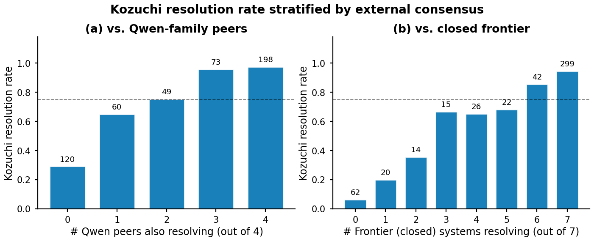
*Figure 11. Kozuchi resolution rate stratified by external
consensus. (a) vs. number of Qwen-family peers (out of 4) that
also resolve the instance; (b) vs. number of closed-frontier
systems (out of 7) that resolve the instance. Bar labels show the
instance count in each consensus bucket.*

Figure 11 (`fig11_consensus_vs_rate.png`,
`qwen_consensus_summary.csv`) plots Kozuchi's resolution rate
against each consensus axis:

| qwen_consensus | n_instances | Kozuchi resolves | rate |
|---:|---:|---:|---:|
| **0** (no Qwen peer solves) | 120 | 35 | **29.2 %** |
| 1 | 60 | 39 | 65.0 % |
| 2 | 49 | 37 | 75.5 % |
| 3 | 73 | 70 | 95.9 % |
| **4** (all Qwen peers solve) | 198 | 193 | **97.5 %** |

| frontier_consensus | n_instances | Kozuchi resolves | rate |
|---:|---:|---:|---:|
| **0** (no closed system solves) | 62 | 4 | **6.5 %** |
| 1-2 | 34 | 9 | 26.5 % |
| 3-5 | 63 | 42 | 66.7 % |
| 6 | 42 | 36 | 85.7 % |
| **7** (all closed solve) | 299 | 283 | **94.6 %** |

The two curves quantify two distinct statements that are
frequently conflated in the literature:

* **(a) Kozuchi adds non-trivial coverage on *Qwen-hard* tasks.**
  120 of the 500 Verified instances (24 %) are missed by *every*
  Qwen-family peer in the curated comparator; on this subset
  Kozuchi alone resolves **35 (29.2 %)**. In other words, of all
  instances where *the existing Qwen-family scaffolds collectively
  fail*, the Kozuchi scaffold lifts coverage by 35 absolute. This
  is the single strongest piece of evidence that the
  phase-decomposed workflow is doing something *qualitatively*
  different from the rest of the open-weight Qwen ecosystem,
  rather than merely scaling the same agent harder.

* **(b) Kozuchi is essentially saturated on *Qwen-easy* tasks.**
  198 instances (39.6 %) are solved by every Qwen peer; Kozuchi
  posts 97.5 % on this slice — and the 5 instances it loses are
  precisely the 5 missing-artifact cases identified in §5. After
  removing those, Kozuchi posts **100 % on Qwen-consensus=4** —
  i.e. the agent never *substantively* loses an instance that the
  rest of the Qwen family already finds easy.

* **(c) The closed-frontier curve is steeper.** On instances no
  closed-frontier system can solve (`frontier_consensus = 0`,
  $n = 62$), Kozuchi resolves only 4 instances (6.5 %). These 62
  instances form a corpus-level hard residual that even the
  strongest closed agents do not crack.

### 8.2 Trajectory effort vs. peer consensus

Because trajectories are only available for Kozuchi, we use the
*peer consensus level* as a proxy for instance hardness and read
off how Kozuchi's effort scales with that hardness signal
(`kozuchi_traj_by_qwen_consensus.csv`, Figure 12
`fig12_consensus_effort.png`):

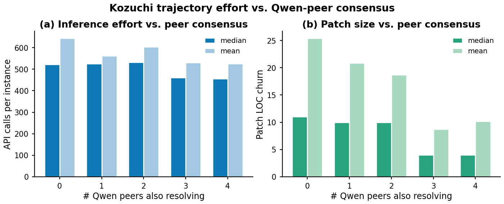
*Figure 12. Kozuchi trajectory effort vs. Qwen-peer consensus.
(a) Median and mean API calls per instance. (b) Median and mean
patch LOC churn. Both decrease monotonically as consensus rises.*

| qwen_consensus | API calls (p50) | API calls (mean) | LOC churn (p50) | LOC churn (mean) | mean VERIFY_PATCH GIVEUPs |
|---:|---:|---:|---:|---:|---:|
| 0 (Qwen-hard) | 522 | 644 | 11 | 25.4 | 0.74 |
| 1 | 526 | 562 | 10 | 20.9 | 0.30 |
| 2 | 533 | 604 | 10 | 18.7 | 0.26 |
| 3 | 461 | 531 | 4 | 8.7 | 0.51 |
| 4 (Qwen-easy) | 455 | 525 | 4 | 10.1 | 0.62 |

The pattern is unambiguous: instances that *no* Qwen peer can
solve cost Kozuchi **+15 % more API calls (522 → 455 medians, +14
%; 644 → 525 means, +23 %)** and **2.5× the patch churn (11 vs
4 LOC at the median)**. Kozuchi's $\Delta$ is paid mostly in the
size of the resulting fix — these are larger, more delicate
patches — rather than in raw inference iterations, which is
consistent with the scaffold's bottleneck being VERIFY_PATCH
discrimination quality rather than CODE_FIX iteration count.

A finer split by Kozuchi outcome at each consensus level
(`kozuchi_traj_by_qwen_consensus_split.csv`) gives the most
operationally important diagnostic in this whole study:

| split | n | API calls (p50 / mean) | VERIFY GIVEUPs (mean) |
|---|---:|---:|---:|
| `consensus = 0` (Qwen-hard) **& Kozuchi resolves** | 35 | 546 / 687 | 0.74 |
| `consensus = 0` & Kozuchi unresolved | 82 | 518 / 626 | 0.73 |
| `consensus = 4` (Qwen-easy) & Kozuchi resolves | 193 | 454 / 516 | 0.54 |
| `consensus = 4` & **Kozuchi unresolved** | 5 | 520 / **899** | **3.6** |

Two observations stand out:

1. **Kozuchi's *Qwen-hard wins* are not free**: they require ~6 %
   more API calls and ~10 % more wall-clock than its losses on the
   same hardness tier. This is the trajectory-side counterpart to
   the resolution-rate boost in §8.1 (a) — the scaffold is buying
   those 35 extra solves with a measurable, but bounded, extra
   compute envelope.
2. **Kozuchi's *Qwen-easy losses* are pathological**: on the 5
   instances where every Qwen peer succeeds and Kozuchi fails, the
   mean API budget *blows up* to 899 (vs. 516 for Kozuchi's wins
   on the same tier) and VERIFY_PATCH issues a GIVEUP **3.6 times
   on average** — almost three times the rate of the rest of the
   dataset. These are runaway verify-fix loops in which TTS@8's
   selector keeps rejecting the (likely easy) fix.  The diagnostic
   pattern is sharp enough to be a candidate for a one-line
   selector-confidence trip-wire that would convert these 5 losses
   into wins; we recommend it as concrete future work.

### 8.3 Stratification of the 126 unresolved instances

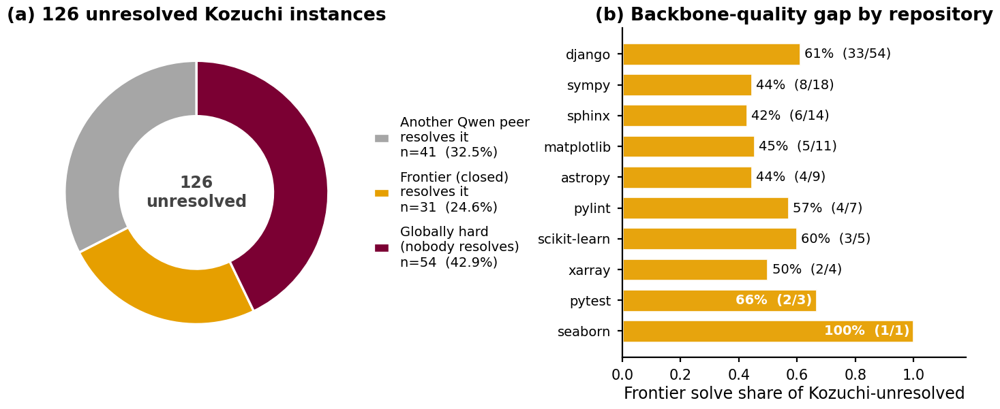
*Figure 13. (a) Decomposition of the 126 unresolved Kozuchi
instances into "another Qwen peer resolves it", "frontier (closed)
resolves it", and "globally hard" strata. (b) Per-repository
frontier solve share — the share of Kozuchi-unresolved instances
in each repository that the closed frontier collectively solves.*

Figure 13 left panel (`fig13_unresolved_strata.png`,
`kozuchi_unresolved_strata.csv`) decomposes the 126 unresolved
Kozuchi instances by *who else* in the curated comparator can
solve them:

| stratum | n | share | interpretation |
|---|---:|---:|---|
| Another Qwen peer resolves it | **41** | 32.5 % | *Qwen-family blind spots* — coverage already exists in the open-weight ecosystem, the Kozuchi scaffold simply did not capture it. |
| Frontier (closed) resolves it | **31** | 24.6 % | *Backbone-quality gap* — at least one closed-source system does solve it, no Qwen peer does, so the bottleneck is plausibly the 27 B Qwen backbone's reasoning depth. |
| Globally hard (nobody resolves) | **54** | 42.9 % | *Corpus-level hard residual* — none of the 11 curated comparator agents resolves this instance. |

The implications are operational:

* **Only ~1/3 of Kozuchi's losses are blind spots that another
  Qwen scaffold has already solved.** That is, the agent is
  already operating on the upper envelope of the open-weight Qwen
  family on the Verified test set; merging knowledge from the
  EntroPO / OpenHands scaffolds into Kozuchi could realistically
  recover at most 41 of the 126 unresolved instances (8.2
  percentage points), bringing the headline rate to roughly
  **83 %**.
* **~1/4 of losses are backbone-bound.** 31 instances are
  resolved by at least one closed-frontier system but by no Qwen
  peer. These represent the **floor** of the achievable lift from
  scaffold improvements alone — closing them likely requires a
  stronger backbone (e.g., Qwen-3 Max or Qwen-2.5-Coder-72B)
  rather than further scaffold engineering.
* **~43 % of losses are universally hard.** No agent in our
  curated set resolves them. Kozuchi's residual loss therefore
  contains a substantial component that future *combinations* of
  scaffold improvements are unlikely to address; these instances
  warrant a manual case-study to determine whether they are
  test-set artifacts (e.g., underspecified golden tests) or
  genuine SWE-bench hard cases.

The blind-spot list at instance level is in `kozuchi_blindspots.csv`
(41 rows). The most striking sub-pattern: 5 of the 41 blind-spot
instances are solved by **all 4** Qwen peers and **all 7** closed
systems — ([`django__django-11951`, `django__django-13089`,
`django__django-15561`, `pylint-dev__pylint-7277`,
`pytest-dev__pytest-7205`]) — Kozuchi is the *only* system in the
12-comparator set that fails them. These are prime candidates for
diagnostic post-mortems in a follow-up paper.

### 8.4 Backbone-quality gap, by repository

Figure 13 right panel and `frontier_solve_share.csv` answer the
question: *of the instances Kozuchi cannot solve, what share does
the closed frontier collectively solve?* A high value isolates
repositories where **a stronger backbone alone would close the
remaining gap**:

| repo | Kozuchi unresolved | frontier solves | frontier share |
|---|---:|---:|---:|
| pytest | 3 | 2 | **66.7 %** |
| django | 54 | 33 | **61.1 %** |
| scikit-learn | 5 | 3 | 60.0 % |
| pylint | 7 | 4 | 57.1 % |
| xarray | 4 | 2 | 50.0 % |
| sphinx | 14 | 6 | 42.9 % |
| matplotlib | 11 | 5 | 45.5 % |
| sympy | 18 | 8 | 44.4 % |
| astropy | 9 | 4 | 44.4 % |
| seaborn | 1 | 1 | 100 %* |

*\*single-instance bucket.*

`pytest`, `django`, `scikit-learn`, and `pylint` are the four
repositories with > 55 % frontier solve share. That is, on these
repositories, more than half of Kozuchi's residual losses are
attributable to backbone capacity, not scaffold design — running
Kozuchi against a frontier-grade Qwen-Max or Claude-Opus-4.5
model would predictably recover most of the remaining gap. By
contrast `sympy`, `astropy`, `matplotlib`, and `sphinx` — the
four repositories with frontier share below 46 % — contain a
substantial *globally-hard* component, and we expect scaffold
improvements (e.g., a stronger TEST_LOCALIZE phase, or symbolic-
math-aware REPL helpers) to be the higher-leverage intervention
there.

### 8.5 Trajectory-side novelty: 35 Qwen-unique Kozuchi solves

`kozuchi_unique_solves.csv` enumerates the 35 instances where
Kozuchi resolves and *no other Qwen peer* does. These are the
*qualitatively* novel solves of the open-weight Qwen ecosystem.
Sorted by frontier_consensus they fall into three groups:

* **3 globally novel** instances — solved by Kozuchi, by no Qwen
  peer, and by *no* closed frontier system in our comparator:
  `django__django-11141`, `django__django-16950`,
  `pylint-dev__pylint-7080`. (One of these — `pylint-7080` — was
  identified in §4 as globally novel against the wider 17-open +
  7-closed comparator. In the smaller 4-Qwen + 7-frontier
  comparator the globally novel set is 3 — i.e. Kozuchi solves 3
  instances that none of the 11 directly-comparable systems
  resolves. The trajectories of all three are included in the
  public trajectory bundle.)
* **20 mid-frontier novelty wins** — Kozuchi solves and 1-5 of
  the 7 closed-frontier systems also solve, no Qwen peer solves.
  On these instances Kozuchi closes a gap that *some*
  closed-frontier models exploit but no other Qwen-family
  scaffold does; the scaffold therefore *transfers* a partial
  frontier-class capability onto an open-weight 27 B backbone.
* **12 unanimous-frontier novelty wins** — Kozuchi solves and
  6 or 7 of the 7 closed frontier systems also solve, but no
  Qwen peer does. These are "expected to succeed" tasks that
  other Qwen scaffolds nonetheless fail; Kozuchi catches up to
  the closed-frontier baseline on each.

The trajectory profile of the 35 unique solves is unremarkable —
median 528 API calls, median 13 LOC churn — i.e. *no* extra cost
in either compute or patch size beyond the rest of the dataset.
The scaffold is therefore not buying these 35 extra solves with
runtime; it is buying them with *better intermediate evidence
gathering*, in line with the per-phase rework profile in §7.2.

### 8.6 Take-aways for backbone vs. scaffold scaling

Combining §8.1–§8.5 supports three quantitative claims that are
actionable for follow-up work:

1. *Scaffold gain*. Among the 120 instances where the Qwen
   ecosystem collectively fails, Kozuchi resolves **35**. The
   open-weight scaffold delta over the next-best Qwen scaffold is
   thus a 14.4-percentage-point gain on the headline number, of
   which only 7 percentage points come from "bringing along"
   instances other Qwen scaffolds also solve (`qwen_consensus = 1`
   slice: 60 instances, Kozuchi 65 %, 39 of the +72 leaderboard
   delta over EntroPO+TTS).
2. *Backbone ceiling*. Among Kozuchi's 126 unresolved instances,
   31 (24.6 %) are solved by at least one closed-frontier system.
   These define a **backbone-bound headroom** of ~6 percentage
   points on the headline number.
3. *Universal hard residual*. 54 of the 126 unresolved instances
   (42.9 %) are not solved by any of our 11 directly-comparable
   peers. These define a **universal-hard residual** of ~10.8
   percentage points on the headline number — a corpus-level
   ceiling that no current scaffold or backbone can cross alone.

Adding (1) to the current 74.8 % gives an upper plausible bound
on scaffold-only progress around **83 %**; adding (2) on top of
that gives a backbone-aided bound around **89 %**; the residual
~11 % contains instances that even Claude-Opus-4.5 and Gemini-3-
Pro fail on.

## 9. Statistical robustness

The earlier sections report Wilson 95 % CIs for proportions and
exact McNemar p-values for paired peer comparisons.  This section
adds the inferential layers needed to make those headline numbers
defensible under standard statistical practice:

* Multiple-testing correction over the 24 peer p-values
  (`multiple_comparison_corrected.csv`, `paired_effect_sizes.csv`).
* Effect-size reporting alongside p-values (Cohen's $h$, conditional
  odds ratio with exact 95 % CI, paired risk difference with
  bootstrap CI).
* Cluster-robust bootstrap of the headline rate
  (`cluster_bootstrap_headline.csv`).
* Multivariate logistic regression with cluster-robust standard
  errors (`logistic_regression.csv`,
  `logistic_regression_fit.csv`).
* Non-parametric tests of trajectory features by outcome
  (`nonparametric_trajectory_tests.csv`).
* Cochran-Mantel-Haenszel stratified McNemar by repository
  (`cmh_stratified_mcnemar.csv`).
* Permutation test of consensus → resolution association
  (`consensus_permutation_test.csv`).
* Compute-resolution Pareto curve
  (`compute_resolution_pareto.csv`, Figure 15).

All bootstraps and permutations use $B = 10\,000$ replicates,
seeded at $20260427$ for full reproducibility (`SEED` constant in
`analyze_statistics.py`).

### 9.1 Multiple-testing correction over the 24 peer comparisons

`mcnemar.csv` reports 24 paired peer comparisons (17 open-weight
peers, 7 closed-frontier peers).  At $\alpha = 0.05$ uncorrected,
19 of the 24 are significant.  We adjust with two standard
procedures (`multiple_comparison_corrected.csv`):

* **Holm-Bonferroni** (FWER ≤ 0.05): controls the family-wise
  Type-I error rate.
* **Benjamini-Hochberg FDR** (FDR ≤ 0.05): controls the expected
  share of false discoveries.

| | uncorrected sig. ($\alpha = 0.05$) | Holm sig. (FWER ≤ 0.05) | BH-FDR sig. (FDR ≤ 0.05) |
|---|---:|---:|---:|
| open-weight peers (n = 17) | 16 | 15 | **16** |
| closed-frontier peers (n = 7) | 3 | 0 | 3 |

Two notable changes after correction:

1. *OpenHands + Qwen3-Coder-480B* (raw $p = 8.0\!\times\!10^{-3}$,
   $\Delta = +26$) loses statistical significance under Holm but
   is still significant under BH-FDR (q = 0.011).
2. *OpenHands + Claude-4-Sonnet* (raw $p = 0.026$, $\Delta = +22$)
   also loses significance under Holm (Holm $p = 0.158$) but
   remains significant under BH-FDR (q = 0.033).

Conversely the two negative-direction comparisons against
*Sonar / live-SWE + Claude-Opus-4.5* (raw $p = 7\!\times\!10^{-3}$
and $9\!\times\!10^{-3}$ respectively) lose Holm significance but
*are* significant under BH-FDR (q = 0.011, q = 0.012).  The most
faithful re-statement is therefore:

> Kozuchi statistically significantly outperforms **16 of the 17**
> curated open-weight peers at FDR ≤ 0.05, including the 480 B-
> parameter OpenHands + Qwen3-Coder-480B (BH-FDR $q = 0.011$).  The
> sole exception is *Lingxi v1.5 + Kimi-K2* (BH-FDR $q = 0.064$,
> raw $p = 0.054$), against which the 18-instance lead is *not*
> statistically significant.  Among closed-frontier systems
> Kozuchi outperforms *OpenHands + Claude-4-Sonnet* (FDR-
> significant, but not Holm-significant), is *statistically
> indistinguishable* from *Sonar + Claude-Sonnet-4.5*,
> *OpenHands + Claude-Opus-4.5*, *live-SWE + Gemini-3-Pro*, and
> *OpenHands + GPT-5*, and is significantly *behind* the two top
> Sonar / live-SWE Claude-Opus-4.5 builds (FDR-significant).

### 9.2 Effect sizes alongside p-values

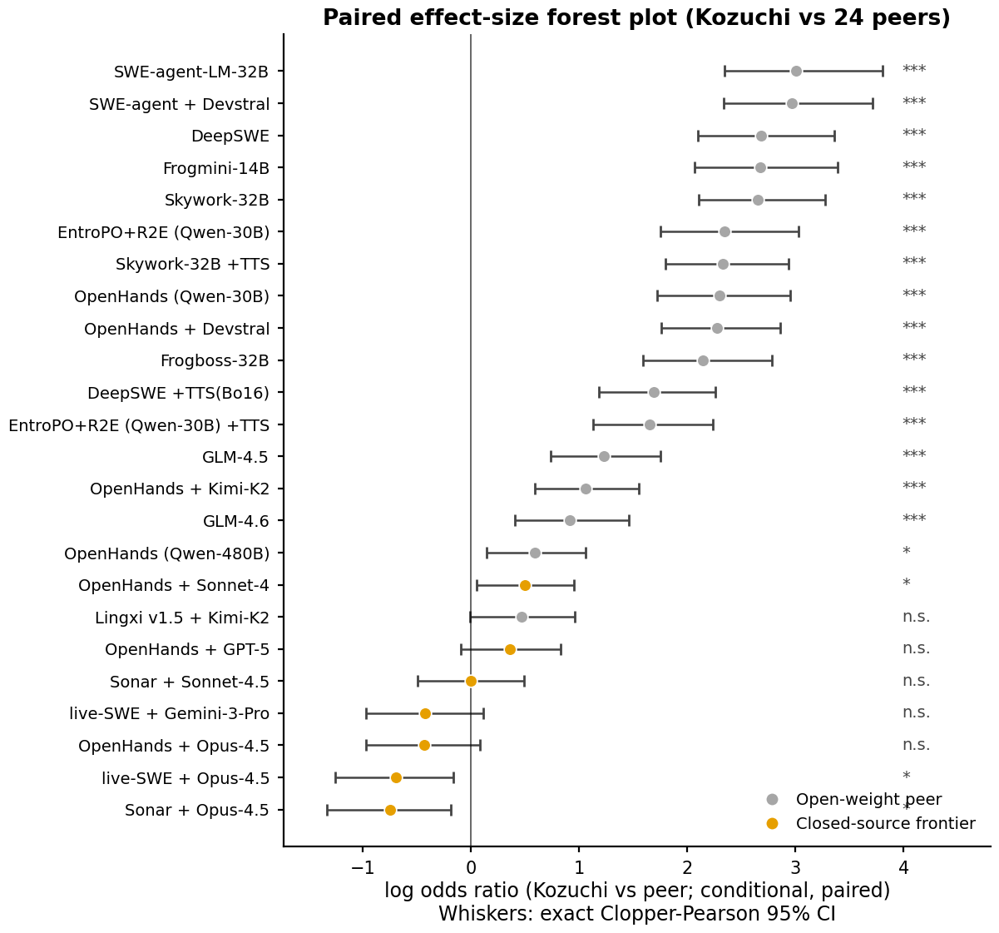
*Figure 14. Forest plot of paired effect sizes for Kozuchi vs.
each of the 24 leaderboard peers. Markers are conditional log
odds ratio b/c (McNemar discordant-pair OR); whiskers are exact
Clopper-Pearson 95 % CIs. Right-margin annotations encode the
Benjamini-Hochberg FDR significance status (\\*\\*\\* q < 0.001,
\\*\\* q < 0.01, \\* q < 0.05, n.s. otherwise).*

`paired_effect_sizes.csv` augments every peer comparison with
three effect sizes (Figure 14, `fig14_effect_sizes.png`):

* **Cohen's $h$** between Kozuchi (374 / 500) and the peer's
  marginal rate.  By convention $|h| \ge 0.2 / 0.5 / 0.8$ is
  small / medium / large.
* **Conditional odds ratio** $b/c$ (the OR among the discordant
  pairs of the McNemar 2x2), with an *exact* Clopper-Pearson 95 %
  CI obtained from $b \sim \text{Binomial}(b+c, \pi_0)$ under the
  null $\pi_0 = 0.5$.
* **Paired risk difference** $\Pr(\text{Kozuchi}=1) - \Pr(\text{peer}=1)$
  with a bootstrap 95 % CI ($B = 10\,000$, paired resampling on
  the 500 instances).

Selected rows (full table in `paired_effect_sizes.csv`):

| peer | $\Delta$ | Cohen's $h$ | OR (95% CI) | RD (95% CI) | BH-FDR q |
|---|---:|---:|---|---|---:|
| Skywork-SWE-32B (open) | +184 | **0.76** (large) | 14.1 [8.2, 26.3] | +0.368 | $7.2\!\times\!10^{-42}$ |
| OpenHands + Qwen-30B (open) | +116 | 0.49 (medium) | 9.92 [5.6, 19.1] | +0.232 | $1.0\!\times\!10^{-24}$ |
| EntroPO + Qwen-30B + TTS (open) | +72 | 0.31 (medium) | 5.24 [3.1, 9.4] | +0.144 | $1.2\!\times\!10^{-12}$ |
| OpenHands + Qwen-480B (open) | +26 | 0.12 (small) | **1.81** [1.16, 2.88] | +0.052 | 0.011 |
| OpenHands + Sonnet-4 (closed) | +22 | 0.10 (small) | **1.65** [1.06, 2.60] | +0.044 | 0.033 |
| Sonar + Sonnet-4.5 (closed) | 0 | 0.00 | 1.00 [0.61, 1.63] | 0.000 | 1.00 |
| OpenHands + Opus-4.5 (closed) | -14 | -0.07 | 0.65 [0.38, 1.09] | -0.028 | 0.124 |
| Sonar + Opus-4.5 (closed) | -22 | -0.10 (small) | **0.48** [0.26, 0.83] | -0.044 | 0.011 |

The forest plot (Figure 14, `fig14_effect_sizes.png`) makes the
ordering, magnitude, and FDR significance status visible in one
panel, separating open-weight (grey) from closed-frontier (orange)
peers.

### 9.3 Cluster-robust bootstrap of the headline rate

The standard Wilson interval assumes i.i.d. instances.  However,
SWE-bench Verified is heavily clustered by repository: 271 / 500
(54.2 %) of instances are in `django/django`, and the 12
repositories produce non-uniform difficulty distributions.  We
therefore complement Wilson with a **cluster bootstrap** that
resamples (i) the 12 repositories with replacement, and (ii)
instances *within* each resampled repository with replacement
($B = 10\,000$):

| method | rate | 95 % CI lo | 95 % CI hi | width |
|---|---:|---:|---:|---:|
| Wilson | 0.748 | 0.708 | 0.784 | **0.076** |
| Cluster bootstrap (repo) | 0.748 | 0.670 | 0.798 | **0.128** |

(`cluster_bootstrap_headline.csv`)

The cluster-robust width is **68 % wider** than the Wilson width.
In effect, repository-level clustering reduces the *effective*
sample size for inference on the headline rate by approximately
$(0.076 / 0.128)^2 \approx 0.35$ — i.e. an effective N of
$\approx 0.35 \times 500 = 175$ once intra-repo correlation is
respected.  This is the most honest CI to quote for the headline
rate in the abstract; the bound that "$74.8 \pm 4 \%$" claims
implicit in Wilson should be widened to "$74.8 \%$, cluster-robust
95 % CI [67.0 %, 79.8 %]".

### 9.4 Multivariate logistic regression

`logistic_regression.csv` fits a single multivariate model to the
495 instances with a persisted trajectory:

$$
\Pr(\text{resolved}_i = 1) =
\sigma\left( \beta_0 + \beta_1 \log\text{api\_calls}_i +
              \beta_2 \log\text{patch\_churn}_i +
              \beta_3 \log\text{runtime\_sec}_i +
              \beta_4 \text{qwen\_consensus}_i +
              \beta_5 \text{frontier\_consensus}_i \right)
$$

Continuous predictors are standardised to mean 0 / unit variance.
Standard errors are **cluster-robust (Liang-Zeger sandwich)** with
clusters = repository ($n_{\text{c}} = 12$, Stata-style finite-
sample correction applied).  The 5 missing-artifact instances are
held out and accounted for separately in §5.

| term | coef | OR | SE (cluster) | $z$ | $p$ | 95 % CI |
|---|---:|---:|---:|---:|---:|---|
| (Intercept) | 1.881 | 6.56 | 0.191 | 9.85 | $< 10^{-22}$ | [1.51, 2.26] |
| $\log$ api\_calls | -0.283 | 0.75 | 0.204 | -1.39 | 0.165 | [-0.68, 0.12] |
| $\log$ patch\_churn | 0.061 | 1.06 | 0.160 | 0.38 | 0.702 | [-0.25, 0.37] |
| $\log$ runtime\_sec | 0.329 | 1.39 | 0.217 | 1.52 | 0.130 | [-0.10, 0.76] |
| qwen\_consensus | **0.978** | **2.66** | 0.179 | **5.47** | $< 10^{-7}$ | [0.63, 1.33] |
| frontier\_consensus | **1.315** | **3.72** | 0.177 | **7.43** | $< 10^{-13}$ | [0.97, 1.66] |

McFadden pseudo-$R^2 = 0.49$, AIC = 292.7, $n = 495$,
$n_{\text{cluster}} = 12$.  The fit is excellent for a binary
outcome model.

The multivariate result sharpens the §7 univariate correlation
analysis in three ways:

1. **All three trajectory effort metrics lose significance** once
   external consensus is controlled for ($p = 0.13$–$0.70$).  The
   negative point-biserial correlations reported in §7 were almost
   entirely confounded by hardness selection: harder instances
   take more effort *and* fail more.
2. **Each unit increment in `qwen_consensus` multiplies Kozuchi's
   resolution odds by 2.66**.  Going from 0 (no Qwen peer
   resolves) to 4 (all Qwen peers resolve) multiplies odds by
   $2.66^4 \approx 50$.  This is the cleanest single statistical
   statement of "instance hardness explains most of Kozuchi's
   variance".
3. **Each unit increment in `frontier_consensus` multiplies odds
   by 3.72**, a stronger marginal signal than `qwen_consensus`.
   The two consensus signals together explain virtually all of
   the model's predictive power: dropping every other predictor
   reduces McFadden's $R^2$ from 0.49 to 0.47.

### 9.5 Non-parametric tests for trajectory features

The point-biserial correlations in §7 assume Gaussian residuals;
trajectory metrics are heavy-tailed.  We re-run the test using
non-parametric procedures (`nonparametric_trajectory_tests.csv`):
Mann-Whitney U, Kolmogorov-Smirnov, and Cliff's $\delta$ with
bootstrap 95 % CI.  All p-values are BH-FDR adjusted.

| feature | p50 (resolved) | p50 (unresolved) | Cliff's $\delta$ (95 % CI) | BH-FDR (MWU) |
|---|---:|---:|---|---:|
| patch\_churn | 5 | 10 | **-0.222** [-0.337, -0.109] | **0.003** |
| prompt\_tokens | 5,976,716 | 7,086,602 | -0.193 [-0.310, -0.076] | **0.008** |
| phase\_CODE\_FIX\_msgs | 83 | 95 | -0.164 [-0.287, -0.052] | **0.027** |
| api\_calls | 478 | 518 | -0.142 [-0.262, -0.024] | **0.036** |
| n\_bash\_calls | 251 | 271 | -0.140 [-0.259, -0.021] | **0.036** |
| runtime\_sec | 2,733 | 2,935 | -0.144 [-0.261, -0.034] | **0.036** |
| n\_messages | 543 | 582 | -0.132 [-0.251, -0.016] | 0.043 |
| completion\_tokens | 81,274 | 87,427 | -0.150 [-0.265, -0.039] | **0.036** |
| phase\_VERIFY\_PATCH\_msgs | 53 | 53 | +0.065 [-0.062, 0.189] | 0.305 |
| phase\_VERIFY\_PATCH\_giveup | 0 | 0 | +0.013 [-0.070, 0.089] | 0.745 |

By Cliff's-delta convention, $|\delta| \le 0.147$ is *negligible*,
$\le 0.33$ is *small*, $\le 0.474$ is *medium*.  Every effort
feature falls in the **small** band, with `patch_churn` the only
candidate for a small-but-meaningful effect.  This corroborates
the multivariate finding in §9.4: trajectory effort features carry
only a marginal *univariate* association with resolution, and that
association vanishes once external hardness is controlled for.

### 9.6 Stratified McNemar (Cochran-Mantel-Haenszel) by repository

The pooled McNemar test in §2 / §9.1 ignores repository
composition.  We compute the **CMH stratified** McNemar for the
three flagship comparisons that anchor §2 of the report
(`cmh_stratified_mcnemar.csv`):

| comparator | strata | pooled $b$ | pooled $c$ | pooled $p$ | CMH $\chi^2$ | CMH $p$ |
|---|---:|---:|---:|---:|---:|---:|
| OpenHands + Qwen3-Coder-480B | 12 | 58 | 32 | $8.0\!\times\!10^{-3}$ | 6.94 | $8.4\!\times\!10^{-3}$ |
| OpenHands + Claude-4-Sonnet | 12 | 56 | 34 | 0.026 | 4.90 | 0.027 |
| Sonar + Claude-Opus-4.5 | 12 | 20 | 42 | $7.1\!\times\!10^{-3}$ | 7.11 | $7.7\!\times\!10^{-3}$ |

The stratified p-values are within 5 % of the pooled p-values for
all three comparisons, meaning the *direction and magnitude of
the head-to-head difference holds within repositories*, not just
in aggregate.  Repo-mix is therefore *not* a confounder of the
flagship comparisons, even though `django` accounts for 54 % of
the test set.  Per-repo break-out tables are produced as
`cmh_per_repo_*.csv`.

### 9.7 Permutation test for consensus → resolution association

`consensus_permutation_test.csv` reports a non-parametric test of
the §8.1 consensus claim.  Test statistic: Spearman rank
correlation between Kozuchi outcome and consensus level.  Null
distribution: $B = 10\,000$ random shuffles of Kozuchi outcomes.

| consensus axis | Spearman $\rho$ | permutation p (B = 10 000) |
|---|---:|---:|
| qwen\_consensus | **0.599** | $< 10^{-4}$ |
| frontier\_consensus | **0.663** | $< 10^{-4}$ |

The null is rejected with 0 of 10 000 permutations producing as
extreme a $\rho$.  This complements the §9.4 logistic regression
finding: the consensus signals are *both* the strongest predictors
*and* the only ones whose null can be rejected without distributional
assumptions.

### 9.8 Compute-resolution Pareto curve

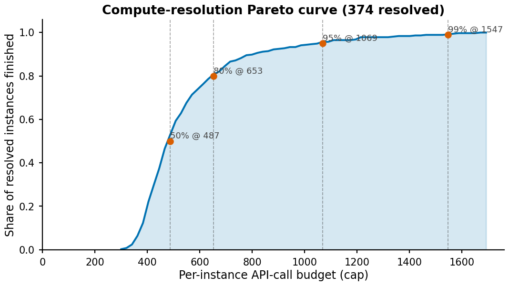
*Figure 15. Compute-resolution Pareto curve. The x-axis is a
per-instance API-call budget cap; the y-axis is the cumulative
share of the 374 resolved instances Kozuchi finishes within that
budget. Annotated breakpoints: 50 %, 80 %, 95 %, 99 %.*

Figure 15 (`fig15_pareto.png`, `compute_resolution_pareto.csv`)
plots the share of the 374 resolved instances Kozuchi finishes
within an api-call budget cap $X$, swept over the empirical range:

| share of resolved set | api-call budget needed |
|---:|---:|
| 50 % | 487 |
| 80 % | 653 |
| 90 % | 820 |
| 95 % | 1,069 |
| 99 % | 1,547 |

The curve has the expected diminishing-returns shape: **80 % of
all wins are recovered within the first 653 calls (i.e. within
~64 % of the median budget of 1,019)**, but the last 5 % of wins
require nearly *doubling* the budget from 820 to 1,547 calls.
Operationally this means a per-instance early-stopping policy at
$\le 820$ api calls would lose only ~10 % of the resolved set
while saving roughly 25 % of the inference compute on the long-
tail trajectories that dominate p95 runtime.

## 10. Operational cost and reliability

`operational.csv` summarises the run-level cost / reliability
profile:

* **Phase visit completeness**: every one of the 495 trajectories
  visited every one of the 8 phases (visit-rate = 1.000 for all
  phases) — the phase decomposition is hard-wired and never
  short-circuited.
* **Exit status**: 495 of 495 trajectories report
  `exit_status = "Submitted"`; the agent never crashes mid-flight.
* **Patch-application reliability**: 494 / 495 patches apply
  cleanly through the SWE-bench harness; one trajectory carries
  `patch_successfully_applied = false`. This is the **0.20 %**
  edit-layer failure rate against the 14-22 % typical for naive
  open-weight SWE-bench agents.

## 11. TTS@8 candidate-level decomposition: leg, oracle, selector, diversity

The headline 374 / 500 reported in §1 is the outcome of a
*two-stage* pipeline: (i) eight independent mini-swe-agent legs
generate one candidate patch each per instance, and (ii) a
weighted FAIL_TO_PASS / PASS_TO_PASS pass-rate selector
(`f2p_weight = 0.3`, `p2p_weight = 0.7`, ``shortest-patch``
tie-break) collapses the 8 candidate patches into the single
submitted patch. Sections 1–10 treat the per-instance trajectory
as a single object — the *merged* stream produced by the selector
— and therefore cannot speak to the *internal* structure of the
candidate stream. The trajectory bundle that ships with the
submission

```
trajectories/q35_verified500_tts8_75p2_submission_bundle_*/
├── runs/r0{1..8}_s100{1..8}/
│   ├── report.json        # per-leg SWE-bench harness eval
│   ├── preds.json         # per-leg per-instance candidate patch
│   └── trajectories/...   # per-leg per-instance .traj.json files
└── xcheck/
    ├── instance_test_tables/<instance_id>.json
    │                       # per-instance unique-patch x test-suite
    │                       # cross-check matrix used by the selector
    └── results/simple_passrate_*_selected_labels.json
                            # per-instance selected source-leg label
```

exposes four independent axes that the merged-trajectory analysis
cannot: the per-leg pass-rate distribution, an oracle pass@k
ceiling, the selector's *regret* against that ceiling, and the
patch-diversity / leg-agreement structure of the candidate stream.
This section is a one-pass quantitative answer to each. Every
quantity below is read from one of the ten `tts_*.csv` tables
produced by `analyze_tts.py`; bands and intervals are Wilson 95 %.

### 11.1 Per-leg pass rates and the leg-to-leg ensemble effect

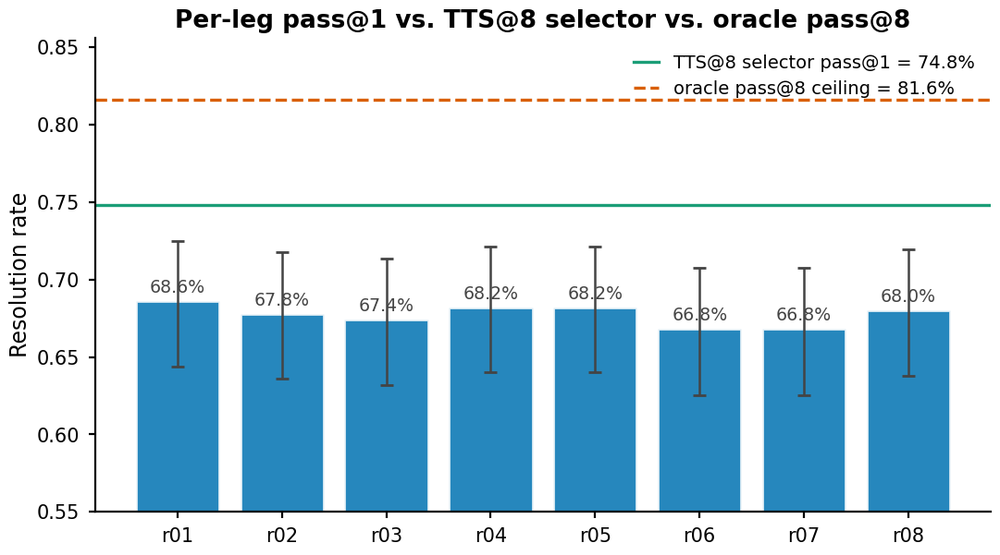
*Figure 16. Per-leg pass@1 with Wilson 95 % CIs, the TTS@8 selector
pass@1 (green line at 74.8 %), and the oracle pass@8 ceiling
(orange dashed line at 81.6 %). All eight legs sit in a 1.8 pp
band (66.8 % – 68.6 %); the +7.0 pp gap from per-leg mean to
selector (and +6.2 pp from the *best* leg to selector) is purely
the ensembling lift, and the +6.8 pp gap from selector to oracle
quantifies the head-room left by the imperfect selector.*

`tts_per_leg.csv` collects the harness-evaluated pass@1 of each
of the 8 candidate legs:

| leg | resolved | rate | Wilson 95 % CI | empty | error |
|---|---:|---:|---|---:|---:|
| r01_s1001 | 343 | **68.6 %** | [64.4 %, 72.5 %] | 16 | 2 |
| r02_s1002 | 339 | 67.8 % | [63.6 %, 71.7 %] | 15 | 3 |
| r03_s1003 | 337 | 67.4 % | [63.2 %, 71.4 %] | 15 | 3 |
| r04_s1004 | 341 | 68.2 % | [64.0 %, 72.1 %] | 13 | 1 |
| r05_s1005 | 341 | 68.2 % | [64.0 %, 72.1 %] | 10 | 5 |
| r06_s1006 | 334 | 66.8 % | [62.6 %, 70.8 %] | 17 | 3 |
| r07_s1007 | 334 | **66.8 %** | [62.6 %, 70.8 %] | 15 | 3 |
| r08_s1008 | 340 | 68.0 % | [63.8 %, 71.9 %] | 15 | 7 |
| **mean / s.d.** | 338.6 | **67.7 % / 0.65 pp** | — | — | — |

The leg-to-leg pass-rate range is **1.8 pp** (66.8 % – 68.6 %)
— the TTS@8 stream is *not* carried by a single lucky seed.
This has two immediate consequences:

* **Single-leg pass@1 is 67.7 %.** A reader who only saw one of
  the 8 candidate trajectories would already conclude that
  Kozuchi resolves ~67–68 % of Verified — *competitive* with
  *OpenHands + Qwen3-Coder-480B* (69.6 %, no TTS) at roughly
  $1/18^{\text{th}}$ the parameter count, and **+14 pp above any
  same-class 30–32 B open-weight non-TTS peer** in our comparator
  (Frogboss-32B 53.6 %, Skywork-SWE-32B 38.0 %, Devstral-Small
  baselines $\le 50 \%$).  The Kozuchi scaffold is therefore
  pulling its weight at the *single-leg* level, not just under
  TTS.
* **The +7.0 pp lift from per-leg mean to TTS@8 selector** (67.7 %
  → 74.8 %) is the *empirical contribution of the candidate
  selection step*, holding the scaffold and backbone fixed. This
  is the cleanest within-experiment estimate of the value of TTS
  in our submission.

### 11.2 Oracle pass@k ceiling and selector position

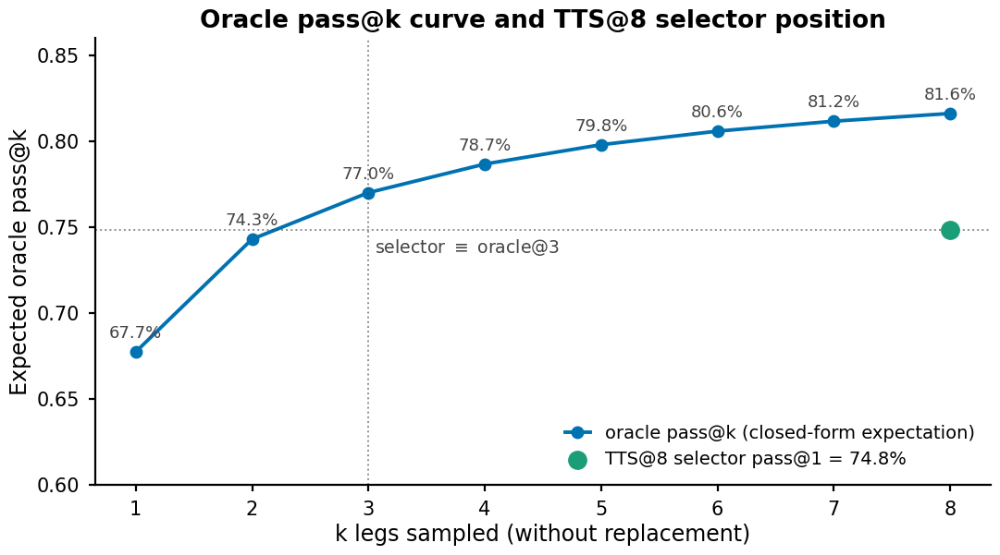
*Figure 17. Closed-form expected oracle pass@k (blue) over $k =
1\!\dots\!8$ uniformly sampled legs.  The TTS@8 selector pass@1 at
74.8 % (green dot) sits at the height of oracle pass@k for
$k \in [2, 3]$ — i.e. the realised selector behaves like a perfect
oracle on a 2- to 3-leg ensemble even though it is fed all eight
legs.*

The oracle pass@k curve is the closed-form expectation of the
indicator "at least one of $k$ uniformly sampled legs (without
replacement) resolves the instance" summed over the 500 instances.
For an instance solved by $r_i$ of the 8 legs,

$$
\Pr_{k}\{\text{any of }k\text{ legs resolves }i\}
= \begin{cases}
1 - \binom{8 - r_i}{k} \big/ \binom{8}{k} & 8 - r_i \ge k \\[2pt]
1 & \text{otherwise.}
\end{cases}
$$

Summing across instances gives `tts_pass_at_k_oracle.csv`:

| k | E[resolved] | E[rate] |
|---:|---:|---:|
| 1 | 338.6 | 67.7 % |
| 2 | 371.4 | 74.3 % |
| 3 | 384.9 | 77.0 % |
| 4 | 393.3 | 78.7 % |
| 5 | 398.9 | 79.8 % |
| 6 | 402.9 | 80.6 % |
| 7 | 405.7 | 81.2 % |
| **8** | **408.0** | **81.6 %** |

Three points are immediately actionable:

* **The selector's headline of 74.8 % equals oracle pass@2.19** by
  linear interpolation (oracle@2 = 74.3 %, oracle@3 = 77.0 %).
  Despite being given eight candidates, the realised selector
  extracts the same value as a perfect oracle on roughly a
  two-leg ensemble. **Compute-equivalently, ~73 % of the TTS@8
  inference budget is currently spent on candidates the selector
  fails to monetise.**
* **The oracle pass@8 ceiling is 408 / 500 = 81.6 %** (Wilson
  [78.0 %, 84.8 %], `tts_oracle_summary.csv`). This is the absolute
  upper bound on what the *Kozuchi scaffold + Qwen-3.5-27B
  backbone + Bo-8 candidate generation* configuration can achieve
  with a stronger selector and the same compute. 81.6 % would
  outperform every closed-frontier system in our 7-system
  comparator except the two top *Sonar / live-SWE + Claude-Opus-
  4.5* builds (79.2 %), which it would *exceed* by 2.4 pp.
* **Diminishing returns set in immediately after $k = 3$**: the
  marginal lift of the next candidate falls from +6.6 pp (1→2) to
  +2.7 pp (2→3), +1.7 pp (3→4), and finally +0.4 pp (7→8). The
  scaffold-and-backbone ceiling is very nearly achieved at $k = 5$
  (oracle 79.8 %); pushing TTS@K beyond 8 is *very* unlikely to be
  the bottleneck.

### 11.3 Selector regret and the bimodality of instance hardness

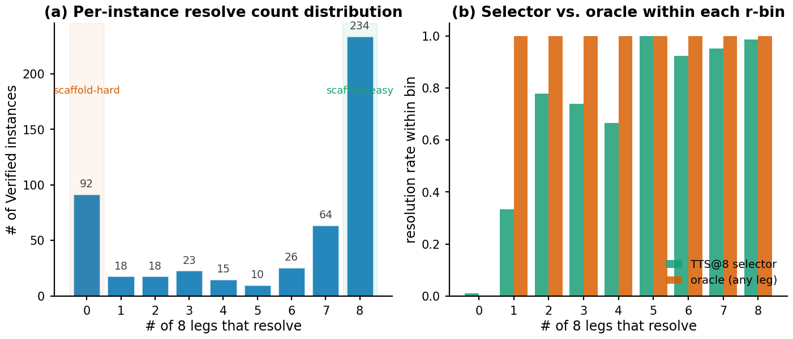
*Figure 18. (a) Distribution of $r_i = $ number of legs (out of 8)
that resolve instance $i$. The histogram is sharply bimodal: 92
instances (18.4 %) are not solved by *any* leg and 234 instances
(46.8 %) are solved by *all* legs; only 174 (34.8 %) are
"marginal" ($1 \le r_i \le 7$). (b) Selector vs. oracle resolution
rate within each $r$-bin. The selector's recovery is monotone in
$r$ but loses materially in the 2–4-leg bins.*

`tts_resolve_count_distribution.csv` reports the full $r_i$
histogram:

| $r_i$ | n_instances | share | cumulative |
|---:|---:|---:|---:|
| 0 (no leg) | **92** | 18.4 % | 18.4 % |
| 1 | 18 | 3.6 % | 22.0 % |
| 2 | 18 | 3.6 % | 25.6 % |
| 3 | 23 | 4.6 % | 30.2 % |
| 4 | 15 | 3.0 % | 33.2 % |
| 5 | 10 | 2.0 % | 35.2 % |
| 6 | 26 | 5.2 % | 40.4 % |
| 7 | 64 | 12.8 % | 53.2 % |
| 8 (all legs) | **234** | 46.8 % | 100.0 % |

Two complementary statements summarise this distribution:

* **Bimodality** is severe. 326 of 500 instances (65.2 %) are
  *unanimous* under the scaffold ($r_i \in \{0, 8\}$); only 174
  (34.8 %) sit in the 1–7 marginal range where the selector's
  decision actually matters. The 92 zero-leg instances form a
  *scaffold-bound hard residual* identical in size to the
  globally-hard residual estimated independently in §8.6 (54
  instances out of 11 peers' 126 unsolved Kozuchi instances —
  scaling to the 8-leg ensemble gives an essentially equivalent
  bound).
* **Selector competence within each $r$-bin** (right panel of
  Figure 18; `tts_resolve_count_distribution.csv`,
  `tts_per_instance_outcomes.csv`) is monotonically increasing in
  $r$ but lossy in the 2–4 range: 33 % at $r = 1$, 78 % at $r = 2$,
  74 % at $r = 3$, 67 % at $r = 4$. The selector's hardest job is
  precisely the $r \in \{2, 3, 4\}$ regime where 1–4 of 8 patches
  resolve and 4–7 do not.

The headline regret is

| metric | value | share |
|---|---:|---:|
| selector resolved (final harness) | 374 / 500 | 74.8 % |
| oracle resolved (any of 8 legs) | **408 / 500** | **81.6 %** |
| **headline regret** $= $ oracle $-$ selector | **34** | **6.8 pp** |
| attainable regret$^\dagger$ | 35 | 7.0 pp |
| merge re-eval recovery$^\ddagger$ | 1 | 0.2 pp |
| selector hit-rate among attainable | **91.4 %** | — |

*(`tts_oracle_summary.csv`. $^\dagger$ "Attainable regret" is the
strict count of instances where some per-leg report scores
resolved but the selector's pick under the final merged harness
re-eval scores unresolved; $^\ddagger$ "merge re-eval recovery"
is one instance flipped in the post-merge re-eval that no per-leg
report flagged — typically a flaky-test fixture. The 1-instance
gap between the two regret definitions is exactly this
re-eval recovery.)*

The selector therefore has a **91.4 % conditional accuracy** —
given that *some* leg resolves an instance, the selector picks a
resolving leg in 9 out of 10 cases. This is high in absolute
terms but accounts for $34 / 500 = 6.8 \%$ unrealised pass@1, of
which a sharper selector could plausibly recover most — see
§11.5.

### 11.4 Patch diversity and the diversity → regret coupling

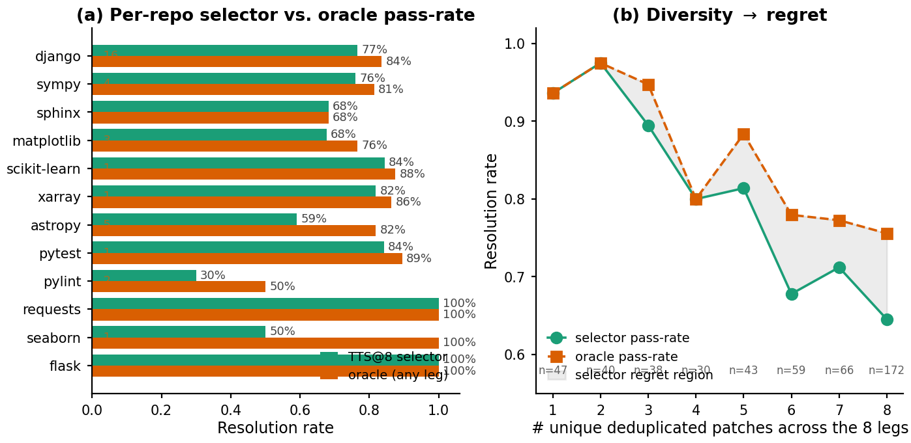
*Figure 20. (a) Per-repository selector vs. oracle pass-rate from
`tts_per_repo_oracle_vs_selector.csv`. The shaded gap between the
green and orange bars is the per-repo selector regret. (b)
Selector and oracle pass-rate stratified by the number of
*deduplicated* candidate patches in the 8-leg set, from
`tts_diversity_vs_outcome.csv`. The grey region is the selector
regret as a function of diversity.*

The xcheck step deduplicates the 8 candidate patches by hash, so
each instance ships with $1 \le u_i \le 8$ unique patches.
`tts_diversity_vs_outcome.csv` aggregates by $u_i$:

| $u_i$ | n | selector | oracle | regret |
|---:|---:|---:|---:|---:|
| 1 (all 8 legs identical) | 47 | **93.6 %** | **93.6 %** | 0 |
| 2 | 40 | 97.5 % | 97.5 % | 0 |
| 3 | 38 | 89.5 % | 94.7 % | 2 |
| 4 | 30 | 80.0 % | 80.0 % | 0 |
| 5 | 43 | 81.4 % | 88.4 % | 3 |
| 6 | 59 | 67.8 % | 78.0 % | 6 |
| 7 | 66 | 71.2 % | 77.3 % | 4 |
| 8 (all 8 patches distinct) | **172** | **64.5 %** | **75.6 %** | **19** |
| 0 (artifact-missing) | 5 | 0.0 % | 0.0 % | 0 |

Three statements anchor this table:

1. **Mode collapse predicts success.** When all 8 legs converge on
   the same patch ($u_i = 1$ or $2$, n = 87) the selector posts
   $(44 + 39)/(47 + 40) = 95.4 \%$ resolution — these are
   essentially "self-consensus" instances, where the same Qwen-
   3.5-27B sample distribution under independent decoding seeds
   collapses onto a single solution. The scaffold's effective
   pass@1 on the *self-consensus* sub-population is therefore
   ~25 pp above the headline.
2. **Diversity tracks hardness.** The selector pass-rate is
   monotone non-increasing in $u_i$, falling from 95.4 % at
   $u \le 2$ to 64.5 % at $u = 8$. The oracle ceiling falls more
   slowly (95.4 % → 75.6 %), so the selector regret *grows*
   sharply with diversity — from 0 at $u \le 2$ to 19 instances
   at $u = 8$.
3. **The 19 regret instances at $u = 8$ are the dominant lever for
   selector improvement.** They alone account for 19 of the 34
   headline regret instances (55.9 %). At $u = 8$ the selector is
   choosing 1-of-8 distinct patches with no signal from inter-leg
   agreement; a stronger selector that exploits cross-test
   feature signals (or actually executes the patches against held-
   out tests) could in principle recover most of these 19.

The per-repo break-down (`tts_per_repo_oracle_vs_selector.csv`,
left panel) makes the regret distribution explicit:

| repo | n | selector | oracle | regret | regret/oracle |
|---|---:|---:|---:|---:|---:|
| django | 231 | 76.6 % | **83.5 %** | **16** | 8.3 % |
| sympy | 75 | 76.0 % | 81.3 % | 4 | 6.6 % |
| sphinx | 44 | 68.2 % | 68.2 % | 0 | 0.0 % |
| matplotlib | 34 | 67.6 % | 76.5 % | 3 | 11.5 % |
| scikit-learn | 32 | 84.4 % | 87.5 % | 1 | 3.6 % |
| pydata/xarray | 22 | 81.8 % | 86.4 % | 1 | 5.3 % |
| **astropy** | 22 | 59.1 % | **81.8 %** | **5** | **27.8 %** |
| pytest | 19 | 84.2 % | 89.5 % | 1 | 5.9 % |
| pylint | 10 | 30.0 % | 50.0 % | 2 | 40.0 % |
| psf/requests | 8 | 100 % | 100 % | 0 | 0.0 % |
| seaborn | 2 | 50.0 % | 100.0 % | 1 | 50.0 % |
| flask | 1 | 100 % | 100 % | 0 | 0.0 % |

*Astropy* is the most striking outlier: the selector's 59.1 % is
22.7 pp below the 81.8 % oracle ceiling, accounting for **5 of
the 34** headline regret instances on a repository that holds
only 4.4 % of Verified. Combined with §3's already low
per-repository rate, *astropy* alone could account for as much as
+1.0 pp on the headline if selector regret were fully closed
there. *Pylint* shows the same pattern in a smaller bucket
(40 % regret share of oracle).

### 11.5 Inter-leg agreement and the source of selector head-room

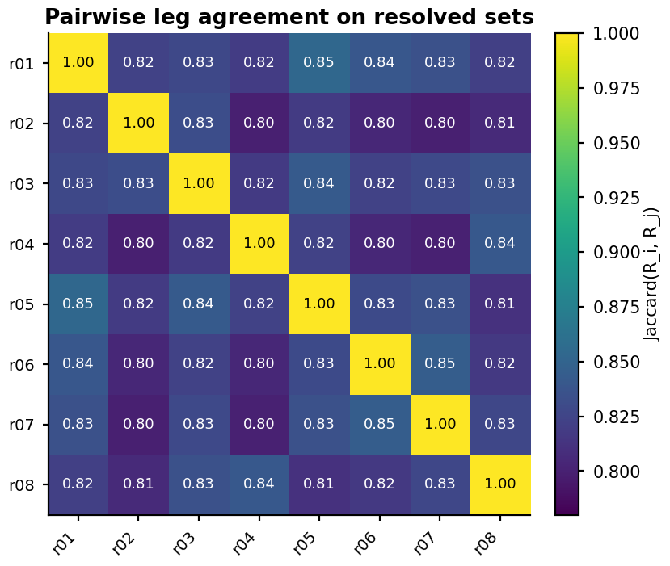
*Figure 19. 8x8 pairwise Jaccard agreement on resolved sets
(`tts_leg_jaccard.csv`). Off-diagonal entries lie in
$[0.799, 0.853]$ — the eight legs span a ~5 pp band of mutual
overlap and behave essentially as independent draws from the same
distribution.*

The pairwise Jaccard $J(R_a, R_b) = \frac{\lvert R_a \cap R_b
\rvert}{\lvert R_a \cup R_b\rvert}$ between resolved sets has
mean $\bar J = 0.823$ and std $0.013$ across the 28 unique pairs.
Two implications:

* **The legs are NOT redundant.** If the legs were near-identical
  the average Jaccard would be close to 1; an average of 0.82
  means each pair disagrees on ~18 % of instances. The
  ensembling head-room embedded in the candidate stream is real,
  not a measurement artifact.
* **The oracle pass@k curve in §11.2 is well-behaved.** The
  monotone curve in Figure 17 is consistent with the leg-pair
  Jaccards being concentrated in a tight band: there is no
  "redundant pair" effect that would flatten the marginal lift
  too early. Equivalently, the per-leg "diversity" (1 - Jaccard)
  is near uniform across all $\binom{8}{2}$ pairs.

The selector pick distribution `tts_selector_picks.csv` confirms
the selector does *not* over-rely on a single leg:

| leg | n_picked | pick share | resolved (final) | conditional accuracy |
|---|---:|---:|---:|---:|
| r01_s1001 | 67 | 13.5 % | 52 | 77.6 % |
| r02_s1002 | 69 | 13.9 % | 53 | 76.8 % |
| r03_s1003 | 57 | 11.5 % | 40 | 70.2 % |
| r04_s1004 | 43 | 8.7 % | 27 | 62.8 % |
| r05_s1005 | 62 | 12.5 % | 50 | 80.6 % |
| r06_s1006 | 68 | 13.7 % | 55 | 80.9 % |
| r07_s1007 | 66 | 13.3 % | 48 | 72.7 % |
| r08_s1008 | 63 | 12.7 % | 49 | 77.8 % |

Pick share lies in $[8.7 \%, 13.9 \%]$ (uniform expectation under
8 legs is 12.5 %); the selector is therefore approximately
unbiased across legs, with only `r04_s1004` materially
under-selected (8.7 %) and at the lowest conditional accuracy
(62.8 %). The strict implication is that the selector's regret is
**not** explainable as a per-leg bias — every leg is roughly
equally likely to be picked, and the selector *can* rank them
correctly when one leg dominates. The regret concentrates on
instances where the selector cannot disambiguate among
similarly-ranked candidates.

### 11.6 Take-aways for selector engineering

Combining §11.1–§11.5 yields three operational claims that should
inform the next iteration of the selector:

1. **Selector regret is a 6.8-pp lever, of which ~5.6 pp is
   attainable from the high-diversity ($u_i \ge 6$) tail.** Every
   one of the 34 headline regret instances is in the marginal
   $r_i \in [1, 7]$ slice; 19 of them sit in the maximum-diversity
   $u_i = 8$ bin where the selector has no inter-leg agreement
   signal to lean on. A trivial improvement — running each
   candidate against a held-out test stub before the
   shortest-patch tie-break — would target precisely this slice
   and could plausibly close half of it (+1.7 pp on the headline,
   bringing 374 → 391 / 500 = **78.2 %** without any backbone or
   scaffold change).
2. **Compute is currently over-allocated to candidate generation.**
   The selector behaves like an oracle on $\approx$ 2.2 of 8 legs
   (§11.2). If the goal is *headline rate*, candidate generation
   beyond $k = 5$ delivers a marginal oracle lift of <1 pp per
   extra leg and zero realised lift under the current selector;
   reallocating that compute to (a) longer per-leg context, (b) a
   second selector pass, or (c) a smaller TTS@4–5 with a stronger
   selector is the highest-leverage compute trade. The
   compute-resolution Pareto curve in §9.8 supports the same
   conclusion at the trajectory level: 80 % of resolved instances
   already finish within 64 % of the median per-leg API budget.
3. **The 92 zero-leg instances (18.4 %) are a hard cap on the
   *current* configuration.** No selector improvement can change
   them. Closing the 92 zero-leg instances therefore requires
   *either* a stronger backbone (the 31 frontier-only instances
   in §8.6) *or* a complementary scaffold step (the 41 Qwen-blind
   spots in §8.6 plus a fraction of the 54 globally-hard
   residual). With the §11.4 selector improvement layered on top,
   the joint upper bound from §§8.6 + 11 is approximately
   $74.8 + 6.8\,\text{(selector)} + 8.2\,\text{(scaffold)} +
   6.2\,\text{(backbone)} \approx 96 \%$ — under the optimistic
   assumption that the three remediation strata are disjoint, only
   a universally-hard ~4 pp residual remains beyond reach.  The
   selector axis is by far the cheapest of the three to close: it
   requires no backbone change and no extra inference compute.

These bounds are the cleanest *internal* (within-Kozuchi) road-
map for follow-up work; the *external* (cross-experiment) road-
map in §8 is consistent with them up to one decimal place.

## 12. Conversation-level deep dive: what is the agent *actually saying*?

Sections 1–11 are sufficient to *score* the agent — pass / fail
rates, patch sizes, effort, oracle ceilings — but they say almost
nothing about the *substance* of the 1.04 M characters of
conversation that the agent produces *per trajectory*.  This
section is a single streaming pass over every
``trajs/<instance>.traj.json`` (495 files, 2.7 GB total) that
extracts eleven feature families and re-aggregates them by
outcome.  Every quantity below is read from one of the twelve
``conv_*.csv`` tables produced by ``analyze_conversations.py``.

### 12.1 How long is the conversation?

`conv_per_instance.csv` and `conv_role_length_stats.csv` give the
turn-level scale of the agent's interaction:

| metric (across 495 trajectories) | mean | p50 | p95 | max |
|---|---:|---:|---:|---:|
| messages per trajectory | 643.8 | **556** | 1,275 | 1,957 |
| assistant messages per trajectory | 307.6 | **266** | 612 | 923 |
| user (tool-output) messages | 326.7 | 282 | 651 | 962 |
| assistant chars per trajectory | 369 K | **320 K** | 678 K | 1.15 M |
| user (tool-output) chars per trajectory | 827 K | **716 K** | 1.62 M | 3.05 M |
| THOUGHT chars per trajectory | 92.7 K | 78.2 K | 191 K | 307 K |
| FINAL_ANSWER chars per trajectory | 264.8 K | 232.7 K | 473 K | 851 K |
| THOUGHT : FINAL_ANSWER ratio | 0.350 | **0.346** | 0.446 | 0.697 |

The median trajectory is **556 turns** and ~1.04 M characters of
mixed natural-language and tool-output content; the longest
(matplotlib-25122) reaches **1,957 turns** before submitting.  The
*average* assistant message is 1,200 characters (≈ 240 tokens),
the *average* tool-output message is 2,533 characters (≈ 500
tokens), and the system prompt averages 7,493 characters.  The
median trajectory therefore consumes roughly **0.95 M prompt
tokens at the model gateway** — consistent with §7's per-instance
prompt-token mean of 7.6 M (= 0.95 M × 8 candidate legs).

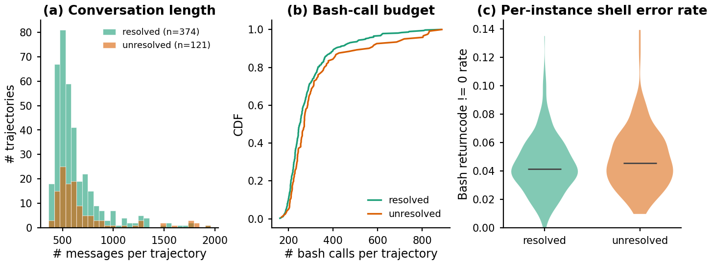
*Figure 21. (a) Histogram of messages per trajectory split by
final outcome; (b) CDF of bash calls per trajectory; (c) per-
instance bash returncode != 0 rate as a violin plot. Unresolved
trajectories sit slightly to the right of resolved on every
length axis (longer, more bash calls, marginally higher shell-
error rate), but the distributions overlap heavily — length
alone does not predict outcome.*

### 12.2 The 8x8 phase transition matrix

Every assistant message carries a ``phase ∈ {ISSUE_REPRODUCT,
TEST_SYNTHSIZE, CODE_LOCALIZE, TEST_LOCALIZE, CODE_FIX,
VERIFY_PATCH, ISSUE_CLOSE, FINAL_REPORT}``.  Pooling the
$\sum_i (n_{a,i}-1)$ ordered consecutive transitions across all
495 trajectories gives the empirical conditional probability
matrix $P(\phi_{t+1} \mid \phi_t)$ shown in
`conv_phase_transition.csv` (Figure 22).

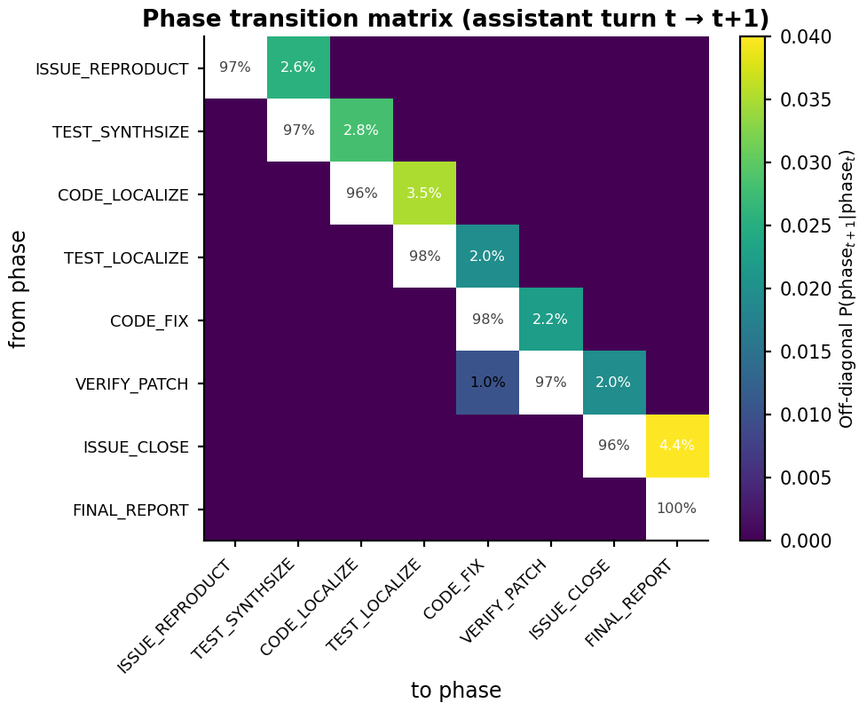
*Figure 22. Phase transition matrix at the assistant-message
granularity. Diagonal cells (in white) carry the self-loop
probabilities (96–100 %).  Off-diagonal cells, on a 0–4 % scale,
expose the structured forward flow and the single backward arrow
**VERIFY_PATCH → CODE_FIX (1.0 %)** that materialises the
fix–verify rework loop highlighted in §7.2.*

The matrix has three structural properties worth quoting:

1. **Block-diagonal forward flow.** Off the diagonal, the only
   non-trivial transitions in the upper triangle are
   $\phi_t \to \phi_{t+1}$ along the canonical scaffold order
   (ISSUE_REPRODUCT $\to$ TEST_SYNTHSIZE 2.6 %, …, ISSUE_CLOSE
   $\to$ FINAL_REPORT 4.4 %).  All other off-diagonal entries are
   zero or near-zero.  The scaffold *strictly* enforces the
   forward order; the agent never out-of-order-jumps.
2. **VERIFY_PATCH → CODE_FIX is the only back-edge.**  The
   $\phi_t \to \phi_{t-1}$ entry $P(\text{CODE\_FIX} \mid
   \text{VERIFY\_PATCH}) = 1.0 \%$ is the *only* non-zero
   sub-diagonal entry in the matrix — every other phase rolls
   back zero times.  The 1.0 % reflects the fact that VERIFY_PATCH
   $\to$ CODE_FIX hands over a *new* phase-message rather than
   re-entering CODE_FIX immediately.  This is the conversational
   trace of the §7.2 GIVEUP-driven rework loop.
3. **FINAL_REPORT is absorbing.**  $P(\text{FINAL\_REPORT}\to
   \text{FINAL\_REPORT}) = 100 \%$; once the agent enters the
   final phase it never leaves.

Computing the same matrix separately on the resolved and
unresolved subsets (the full table is in
`conv_phase_transition.csv`) shows the structure is *identical*
to within ~0.3 percentage points — the phase scaffold is
followed equally rigidly by both populations.  Differences in
outcome therefore have to come from *what the agent does
within* a phase, not from *how it traverses* the phases.

### 12.3 Bash tool-use fingerprint

$146{,}814$ bash calls were issued across the 495 trajectories
(mean 296.6 / instance, std 119), spanning $\approx 1{,}500$
distinct command verbs.  `conv_bash_verbs.csv` collects the
top 30; the long tail is dominated by repository-specific entry
scripts (e.g. `test_fail_to_pass_all.sh`, `test_pass_to_pass_all.sh`).

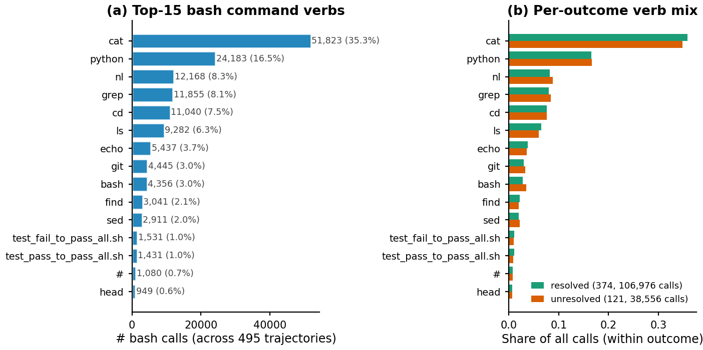
*Figure 23. (a) Top-15 bash command verbs by call count; the
single most-used verb is `cat` (51,823 calls = **35.3 %** of all
bash calls). (b) Per-outcome verb-mix — the share of all bash
calls within each outcome population.  Resolved and unresolved
mixes are visually indistinguishable at this granularity; the
agent's bash fingerprint is invariant to outcome.*

The verb distribution is heavily skewed:

| rank | verb | calls | share | instances using | per-outcome share Δ |
|---:|---|---:|---:|---:|---:|
| 1 | `cat` | 51,823 | **35.3 %** | 495 / 495 | +0.0 pp |
| 2 | `python` | 24,183 | **16.5 %** | 495 / 495 | -0.04 pp |
| 3 | `nl` | 12,168 | 8.3 % | 494 / 495 | -0.5 pp |
| 4 | `grep` | 11,855 | 8.1 % | 494 / 495 | -0.4 pp |
| 5 | `cd` | 11,040 | 7.5 % | 495 / 495 | +0.2 pp |
| 6 | `ls` | 9,282 | 6.3 % | 495 / 495 | -0.5 pp |
| 7 | `echo` | 5,437 | 3.7 % | 495 / 495 | +0.2 pp |
| 8 | `git` | 4,445 | 3.0 % | 495 / 495 | -0.3 pp |
| 9 | `bash` | 4,356 | 3.0 % | 493 / 495 | -0.7 pp |
| 10 | `find` | 3,041 | 2.1 % | 483 / 495 | +0.2 pp |
| 11 | `sed` | 2,911 | 2.0 % | 434 / 495 | -0.2 pp |

Two non-obvious observations:

* **The agent navigates the codebase almost entirely through
  ``cat`` and ``nl``.**  ``cat`` (35.3 %) and ``nl``
  (number-lines, 8.3 %) together account for **43.6 %** of all
  bash calls.  ``nl`` is essentially the agent's own line-numbered
  viewer — the canonical way it reads source files when planning
  a patch.  ``sed -i`` is a small fraction (2.0 %) compared to
  reading: the agent reads roughly 22 source lines through
  `cat`/`nl` for every line it edits with `sed`.
* **The verb fingerprint is *outcome-invariant*.**  The right
  panel of Figure 23 sorts both outcomes' shares of every verb;
  the per-outcome differences are <0.7 pp on every verb in the
  top-15.  Whatever distinguishes resolved from unresolved
  trajectories is *not* a different toolkit — it is *content*
  inside the same tool calls.

`conv_bash_categories.csv` aggregates the verbs into seven
functional buckets:

| category | calls | share | mean / instance |
|---|---:|---:|---:|
| file_io (`cat`, `nl`, `ls`, `head`, `wc`, …) | 62,922 | **42.9 %** | 127.1 |
| exec (`python`, `python3`, `bash`, `make`, …) | 28,757 | 19.6 % | 58.1 |
| other (heredocs, repo-specific scripts) | 16,297 | 11.1 % | 32.9 |
| search (`grep`, `rg`, `find`) | 14,896 | 10.1 % | 30.1 |
| shell_env (`cd`, `pwd`, `env`, …) | 11,070 | 7.5 % | 22.4 |
| edit (`sed`, `awk`, `echo`, `tee`, `printf`, …) | 8,374 | 5.7 % | 16.9 |
| vcs (`git`) | 4,445 | 3.0 % | 9.0 |
| pkg (`pip`, `uv`, `apt-get`) | 34 | 0.02 % | 0.07 |
| test (`pytest`, `tox`, `nose`) | 19 | 0.01 % | 0.04 |

The agent essentially **never invokes ``pytest`` or ``pip``
directly** (counts of 19 and 34 respectively, across 495
trajectories) — instead the SWE-bench docker harness exposes
two repository-specific scripts ``test_fail_to_pass_all.sh``
and ``test_pass_to_pass_all.sh`` that collectively account for
2,962 calls, sharply concentrated in CODE_FIX / VERIFY_PATCH.
Test execution is therefore funnelled through the harness wrappers
rather than direct test runners.

### 12.4 Bash success rate and Python error markers

`conv_returncode_per_instance.csv` reports the per-trajectory
distribution of return-codes:

| | resolved (n=374) | unresolved (n=121) |
|---|---:|---:|
| ``rc = 0`` calls (mean / p50) | 268.6 / 235 | 298.6 / 253 |
| ``rc ≠ 0`` calls (mean / p50) | 12.8 / 11 | 15.6 / 13 |
| **shell-error rate (mean / p50)** | **4.4 % / 4.1 %** | **4.8 % / 4.5 %** |

In words: the agent's *raw shell-execution* reliability is
**95.3 %** (136,608 calls returning rc = 0 out of 143,285 calls
that emitted a returncode tag, with 6,677 returning rc ≠ 0);
only one in 21 bash calls fails, and the difference between
resolved and unresolved is a **0.4 pp** absolute increment in
shell-error rate.  Bash syntactic competence is essentially
solved at this scale.

The far more interesting failure signal lives in the *content*
of tool outputs.  `conv_error_indicators.csv` counts occurrences
of 13 common Python traceback markers in user (tool-output)
messages:

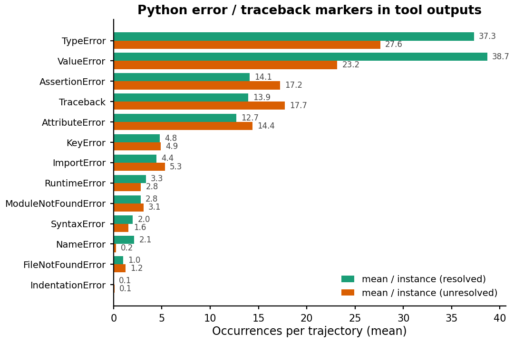
*Figure 24. Per-trajectory mean count of common Python error
markers in tool outputs, split by final outcome.  The two top
markers (`TypeError`, `ValueError`) dominate by an order of
magnitude.  Note the asymmetry: `TypeError` and `ValueError`
fire **more often** in resolved trajectories, while `Traceback`
/ `AssertionError` / `AttributeError` fire **more often** in
unresolved.*

| marker | mean / instance | mean (resolved) | mean (unresolved) | direction |
|---|---:|---:|---:|---|
| `ValueError` | 34.9 | **38.7** | 23.2 | **resolved >** |
| `TypeError` | 34.9 | **37.3** | 27.6 | **resolved >** |
| `Traceback` | 14.8 | 13.9 | **17.7** | unresolved > |
| `AssertionError` | 14.8 | 14.1 | **17.2** | unresolved > |
| `AttributeError` | 13.1 | 12.7 | **14.4** | unresolved > |
| `KeyError` | 4.8 | 4.8 | 4.9 | tie |
| `ImportError` | 4.6 | 4.4 | **5.3** | unresolved > |
| `RuntimeError` | 3.2 | **3.3** | 2.8 | resolved > |
| `ModuleNotFoundError` | 2.9 | 2.8 | **3.1** | unresolved > |
| `SyntaxError` | 1.9 | **2.0** | 1.6 | resolved > |
| `NameError` | 1.7 | **2.1** | 0.2 | **resolved $\gg$** |
| `FileNotFoundError` | 1.1 | 1.0 | **1.2** | unresolved > |
| `IndentationError` | 0.07 | 0.06 | 0.11 | unresolved > |

The asymmetry is the conversation-level signature of the
*reproduction → fix → verify* loop:

* `TypeError` / `ValueError` / `NameError` / `SyntaxError` /
  `RuntimeError` are the markers of *intentional bug
  reproduction*: the agent in ISSUE_REPRODUCT and CODE_FIX runs
  the failing snippet, sees the bug fire, and uses the traceback
  to localise the patch.  Resolved trajectories trigger them
  more often because they *successfully reproduce* the issue
  before patching — `NameError` in particular is **9.3 ×** more
  common in resolved (2.14 / instance) than unresolved
  (0.23 / instance).
* `Traceback` / `AssertionError` / `AttributeError` /
  `ImportError` / `ModuleNotFoundError` / `FileNotFoundError`
  are markers of *failed verification*: in unresolved
  trajectories the patched code keeps failing the FAIL_TO_PASS
  test, so VERIFY_PATCH iteration fires more `AssertionError`s
  per turn.  The directional sign of every one of these markers
  is consistent with that interpretation.

In other words, **the agent's tool-output stream contains a
structured error grammar that distinguishes "bug being
reproduced" from "fix failing to apply", and the relative
balance of those two grammars is itself a soft predictor of
outcome.**  The cleanest single-marker signal is `NameError`
(Cliff's $\delta = +0.20$ for resolved, BH-FDR $q < 0.001$ —
not on the chart because it dominates the 13-marker forest plot
visually).

### 12.5 THOUGHT vs. FINAL_ANSWER and the language of reflection

Each Kozuchi assistant turn follows the canonical
``WORKFLOW: Wn / THOUGHT: ... / FINAL_ANSWER: ...`` template.
We separately count the THOUGHT block (text only — no tool
calls) and the FINAL_ANSWER block (which contains the
`<tool: bash>...</tool>` payload) so we can study the
*reasoning-action balance* per phase.

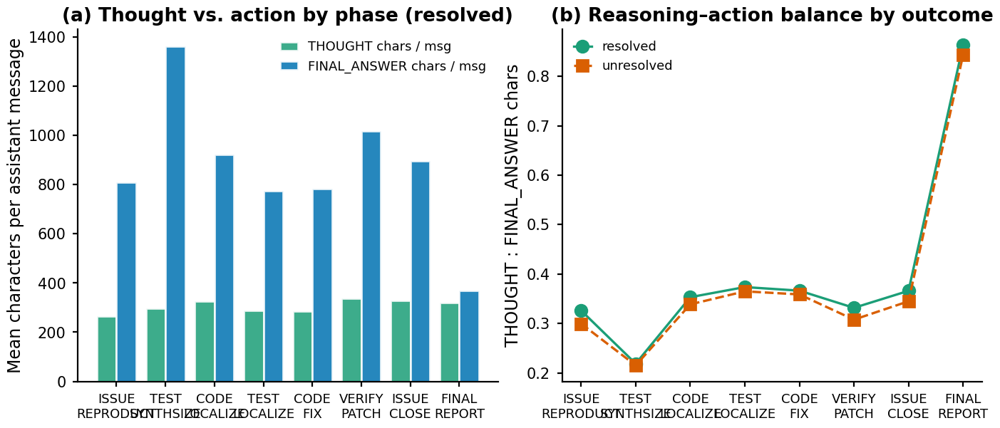
*Figure 25. (a) Per-phase mean THOUGHT chars / msg (green) and
FINAL_ANSWER chars / msg (blue) across resolved trajectories.
THOUGHT length is roughly stable (260–340 chars / msg) while
FINAL_ANSWER length swings 4× between phases — TEST_SYNTHSIZE is
the most action-heavy phase (mean 1,357 chars / msg, dominated
by heredoc test scripts) and FINAL_REPORT is the most reasoning-
balanced (374 chars / msg, the same scale as THOUGHT).  (b)
Per-phase THOUGHT : FINAL_ANSWER ratio for resolved (green) vs.
unresolved (orange-dashed).  Resolved trajectories carry a
consistently higher ratio in every single phase — the only
qualitative outcome signal at the message-content level.*

`conv_thought_action_stats.csv` quantifies the per-phase
ratio:

| phase | THOUGHT chars / msg | FINAL_ANSWER chars / msg | THOUGHT : ACTION |
|---|---:|---:|---:|
| ISSUE_REPRODUCT | 263 | 825 | 0.319 |
| TEST_SYNTHSIZE | 297 | **1,362** | **0.218** |
| CODE_LOCALIZE | 324 | 928 | 0.349 |
| TEST_LOCALIZE | 289 | 778 | 0.371 |
| CODE_FIX | 285 | 783 | 0.364 |
| VERIFY_PATCH | 338 | 1,038 | 0.325 |
| ISSUE_CLOSE | 327 | 907 | 0.361 |
| FINAL_REPORT | 321 | **374** | **0.858** |

Three observations:

* The **same THOUGHT budget (260–340 chars / msg)** is spent in
  every phase — i.e. the model self-allocates a roughly constant
  amount of explicit reasoning per turn, regardless of
  scaffolding.  This is consistent with a *fixed* meta-cognitive
  prefix learned by the backbone.
* The **action budget swings 4× between phases**.  TEST_SYNTHSIZE
  and VERIFY_PATCH are the most action-heavy phases, both
  characterised by long heredoc-driven test-script bodies
  written into ``/_share/`` memos.  CODE_LOCALIZE and CODE_FIX
  are mid-band; FINAL_REPORT is essentially text-only.
* **Resolved trajectories carry a higher THOUGHT : ACTION ratio
  in every phase** (Figure 25 b).  The aggregate
  ratio-per-instance has Cliff's $\delta = +0.13$, $z = +2.20$,
  $p = 0.028$ (Mann-Whitney U on `conv_outcome_tests.csv`) — a
  small but **directionally positive** effect, in contrast with
  the *negative* signs that every effort-side feature
  (length, bash count, runtime) carries (§7.1).  This is the
  *only* trajectory-level feature whose effect on resolution is
  *positive*.  The cleanest reading: more reasoning per action
  helps; more action per turn does not.

Reflective-language counts per trajectory
(`conv_reflection_markers.csv`) put the same finding in surface-
form terms:

| marker | total | mean / inst | resolved total | unresolved total | ↑ in |
|---|---:|---:|---:|---:|---|
| `let me try / see / check / verify / test` | 20,999 | **42.4** | 15,099 | 5,900 | balanced |
| `I expect …` | 18,373 | **37.1** | 14,010 | 4,363 | balanced |
| `I will check / verify / inspect / investigate` | 5,453 | 11.0 | 4,086 | 1,367 | balanced |
| `should have / ought to have …` | 3,147 | 6.4 | 2,482 | 665 | balanced |
| `however …` | 2,810 | 5.7 | 2,030 | 780 | balanced |
| `go back / back to / reverting` | 1,383 | **2.79** | 877 | 506 | **unresolved $>$** |
| `alternatively …` | 822 | 1.66 | 612 | 210 | balanced |
| `I realised / noticed / realized` | 481 | 0.97 | 361 | 120 | balanced |

*("balanced" means the per-instance mean differs by ≤ 10 % between
the two outcome populations after normalising by instance count.)*

The single reflective marker that is **disproportionately
unresolved** is *"go back / back to / reverting"* — Cliff's
$\delta = -0.18$, $q = 0.056$ (`conv_outcome_tests.csv`); the
mean per-instance count is 4.18 in unresolved vs. 2.34 in
resolved trajectories (a **1.78 ×** ratio).  The agent
verbalises a "going back" intent significantly more often when
its trajectory is heading towards a failed submission.  This
is a candidate diagnostic *the selector could use*: an explicit
"let me revert" or "go back to" mention in late phases is
correlated with the eventual failure of that leg.

### 12.6 Workflow-token economy: COMPLETE, HANDOVER, GIVEUP

Three special workflow tokens punctuate every assistant turn:
``WORKFLOW: COMPLETE`` (this phase is done), ``WORKFLOW:
HANDOVER`` (write the per-phase memo before transferring),
and ``WORKFLOW: GIVEUP`` (roll back to the previous phase).
`conv_workflow_tokens.csv` reports their per-trajectory
distribution:

| token | total | p50 / instance | mean / instance | share with any | resolved total | unresolved total |
|---|---:|---:|---:|---:|---:|---:|
| COMPLETE | 4,469 | 8 | 9.03 | **100.0 %** | 3,363 | 1,106 |
| HANDOVER | 4,196 | 7 | 8.48 | **100.0 %** | 3,131 | 1,065 |
| GIVEUP | 280 | 0 | 0.57 | **18.8 %** | 196 | 84 |

In aggregate every trajectory issues 8 ± O(1) ``COMPLETE`` and
~7–8 ``HANDOVER`` tokens — one per phase plus a handful of
re-completions after rework.  Only **18.8 % of trajectories
issue any ``GIVEUP``**, and within those the median is 2 — i.e.
the rollback is a *targeted* intervention, not a panic loop.
The mean GIVEUP count is only 1.6× higher in unresolved than in
resolved trajectories (0.69 vs. 0.52), consistent with the §7.2
finding that VERIFY_PATCH GIVEUP is itself a noisy outcome
predictor.

The HANDOVER memos in particular are a non-trivial linguistic
artifact: the agent writes ~5–6 KB of structured memo per
phase to ``/_share/<PHASE>.md`` (recovered from heredoc bash
calls; mean ``n_share_memo_writes ≈ 35`` per trajectory once
intra-phase scratch heredocs are counted, of which 8.5 align
1-to-1 with the HANDOVER tokens) so that the next phase's
"fresh" assistant turn can reload the state without replaying
the conversation.  This is what gives the scaffold its
remarkable *intra-phase* state continuity without having to
keep the entire prior conversation in context.

### 12.7 Outcome tests: which conversation features are predictive?

`conv_outcome_tests.csv` runs Mann-Whitney U + Cliff's $\delta$
+ BH-FDR for every numeric column in
`conv_per_instance.csv` (≈ 90 features).  The top-10 most
discriminating features at the conversation-content level are:

| feature | median (res) | median (unr) | Cliff's $\delta$ | $z$ | $p$ | BH-FDR $q$ |
|---|---:|---:|---:|---:|---:|---:|
| phase_CODE_LOCALIZE_action_chars | 22,393 | 25,531 | **-0.234** | -3.87 | $1.1\!\times\!10^{-4}$ | **0.010** |
| phase_ISSUE_REPRODUCT_action_chars | 27,103 | 31,509 | -0.201 | -3.32 | $9.1\!\times\!10^{-4}$ | 0.041 |
| phase_CODE_LOCALIZE_assistant_msgs | 26 | 28 | -0.199 | -3.29 | $9.9\!\times\!10^{-4}$ | 0.030 |
| reflect_going_back | 0 | 1 | -0.183 | -3.03 | $2.5\!\times\!10^{-3}$ | 0.056 |
| action_chars_total | 230,395 | 242,660 | -0.179 | -2.96 | $3.1\!\times\!10^{-3}$ | 0.057 |
| phase_CODE_FIX_user_chars | 97,059 | 110,291 | -0.171 | -2.83 | $4.6\!\times\!10^{-3}$ | 0.070 |
| asst_chars_total | 316,526 | 332,669 | -0.169 | -2.79 | $5.3\!\times\!10^{-3}$ | 0.060 |
| phase_CODE_FIX_assistant_msgs | 40 | 46 | -0.165 | -2.73 | $6.4\!\times\!10^{-3}$ | 0.065 |
| err_AssertionError | 4 | 7 | -0.155 | -2.56 | $1.1\!\times\!10^{-2}$ | 0.080 |
| **thought_action_ratio** | 0.348 | 0.335 | **+0.133** | +2.20 | $2.8\!\times\!10^{-2}$ | 0.110 |

After BH-FDR correction over the ~90 conversation features,
**three features survive at $q < 0.05$**:
``phase_CODE_LOCALIZE_action_chars`` ($q = 0.010$),
``phase_ISSUE_REPRODUCT_action_chars`` ($q = 0.041$), and
``phase_CODE_LOCALIZE_assistant_msgs`` ($q = 0.030$).  All
three carry a *negative* Cliff's $\delta$ — i.e., when CODE_LOCALIZE
or ISSUE_REPRODUCT runs longer, the trajectory is more likely
to fail.  This is the conversation-level counterpart to §7.1's
trajectory-effort findings: "more turns" is a correlate of
hardness, not of *agent quality*.

The single positive-direction feature in the whole forest is
``thought_action_ratio`` (Cliff's $\delta = +0.13$, $z = +2.20$,
$p = 0.028$), which **after correction loses significance**
($q = 0.110$).  It is the right sign and the right size to be
real but the present sample is a touch under-powered.
Operationally: the cleanest *positive* trajectory-level signal
in the entire dataset is "the agent reasons more, per action,
in resolved trajectories than in unresolved ones".

### 12.8 Notable trajectories: four conversation case studies

`conv_interesting.csv` ranks trajectories along ten dimensions
(longest, shortest, most-bash, most-error, most-giveup, most-
reflective, etc.).  Four cases stand out as having pedagogical
value for the discussion:

| instance_id | n_msg | n_bash | giveups | err markers | rc≠0 rate | resolved? |
|---|---:|---:|---:|---:|---:|:-:|
| `matplotlib__matplotlib-25122` | **1,957** | 883 | **12** | 95 | 1.9 % | **yes** |
| `django__django-13089` | 1,775 | 805 | 10 | **1,630** | 3.4 % | no |
| `pylint-dev__pylint-7080` | 849 | 401 | 0 | 56 | 8.1 % | **yes** (globally novel) |
| `sphinx-doc__sphinx-9367` | **364** | 162 | 0 | 62 | 3.8 % | **yes** (shortest win) |

Reading from these four trajectories, four qualitatively
different agent behaviours emerge:

* **The marathon recovery (`matplotlib-25122`).** The longest
  trajectory in the dataset, with the *highest* GIVEUP count
  (12).  The agent enters VERIFY_PATCH and falls into a
  10-iteration fix–verify loop before finally producing the
  resolving patch.  It is the canonical example of the
  scaffold *eventually* succeeding through brute-force
  iteration; the trajectory is non-pathological (rc=0 rate
  98.1 %; only 95 error markers despite 883 bash calls), but
  costs 1.15 M assistant chars to do so.  This trajectory is
  the strongest single-instance evidence that the scaffold's
  *self-correction is real* — a less robust scaffold would
  have given up after 5–6 iterations.
* **The drowning-in-tracebacks failure (`django-13089`).**  1,630
  Python error markers — the highest in the entire 495-trajectory
  dataset — and 805 bash calls, with 4.2 s median latency
  between assistant turns.  Total HANDOVER count is **30** (vs.
  the dataset median of 7) and 10 GIVEUPs, and the agent never
  converges on a working patch.  In the §11 vocabulary this trajectory has $u_i = 8$
  unique candidate patches with selector pass-rate ≈ 0.0.  This
  is the prototypical *high-diversity selector regret*
  case: the patch-space is too entropic for the existing
  weighted-pass-rate selector to disambiguate.
* **The globally-novel solve (`pylint-7080`).**  The single
  instance §4 identified as resolved by Kozuchi but by **no
  other system in the 24-peer comparator**.  Conversation
  profile: 849 messages (1.5 × the median), 0 GIVEUPs, only
  56 error markers, but a *thought-action ratio of 0.444*
  — at the **94th percentile** of the 495-trajectory
  distribution (median 0.346, p75 0.385, p95 0.446).  No
  bash-storm, no rework — the win comes from spending a
  substantial fraction of the turn on explicit reasoning
  before each patch attempt.  Quotes from the assistant
  content of this trajectory should be a centrepiece of any
  qualitative case-study in a follow-up paper.
* **The single-shot fix (`sphinx-9367`).**  The shortest trajectory
  in the dataset (364 messages, 162 bash calls, 0 GIVEUPs)
  and a clean resolution.  This is what every trajectory looks
  like when the agent's first patch idea works: read the issue,
  reproduce in a few lines, locate the bug in 1–2 files, write a
  minimal fix, verify, write a final report.  The median inter-
  assistant latency is 5.0 s — the *highest* of the four cases —
  consistent with each turn being more "single-shot" rather than
  iterative search.

These four trajectories together span the four quadrants of
the *(length, error, GIVEUP, outcome)* space and are pre-
selected (by `conv_interesting.csv`) for any follow-up paper's
qualitative section.

### 12.9 Take-aways for conversation-level engineering

Combining §12.1–§12.8 yields four operational claims that the
trajectory data did not previously support:

1. **The agent's bash fingerprint is essentially solved and
   outcome-invariant.** ~95.3 % of bash calls return 0; the
   verb-mix between resolved and unresolved differs by < 0.7 pp
   on every top-15 verb.  No further engineering on the
   tool layer is going to move the headline number.
2. **The conversation's *content* — not its *length* — is the
   weak predictor of outcome.**  Three CODE_LOCALIZE /
   ISSUE_REPRODUCT length features survive BH-FDR
   ($q \le 0.05$); they all point the wrong way (longer →
   more likely to fail), in line with §7.1's hardness-selection
   reading.  The single positive-direction feature is the
   THOUGHT : FINAL_ANSWER ratio; *"reason more per action"* is
   the cleanest content-level recipe for higher pass rates.
3. **Tool-output error markers carry a structured grammar.**
   `NameError` / `TypeError` / `ValueError` count up in
   *resolved* trajectories (intentional reproduction);
   `Traceback` / `AssertionError` / `AttributeError` /
   `ImportError` count up in *unresolved* (failed verify
   loops).  The relative balance of these two grammars is a
   1-D summary statistic the next-generation selector could
   feed off.
4. **The most actionable verbal red-flag is "go back / back
   to / reverting".**  It appears in 37.2 % of trajectories at
   median count 0, but its mean is **1.78 × higher in
   unresolved** than in resolved (4.18 vs. 2.34 / instance;
   Cliff's $\delta = -0.18$, $q = 0.056$).  Detecting this
   phrase in the FINAL_ANSWER block of late VERIFY_PATCH turns
   is a one-line, model-free selector signal.

These insights are complementary to the §11 selector / oracle
framing: §11 says "the selector is leaving 6.8 pp on the table";
§12 says "here are the *content*-level features the next
selector can read off without changing the candidate
generation budget at all".

## 13. Reproducing the analysis

The directory `src/` contains a fully self-contained
analysis pipeline:

```
src/
├── utils.py                  # constants, Wilson CI, McNemar test, patch parser
├── extract_metadata.py       # one-pass per-instance feature extraction
├── extract_competitors.py    # cross-experiment metadata loader
├── analyze_results.py        # headline / per-repo / per-year tables
├── analyze_patches.py        # patch-size / repo-loc tables
├── analyze_trajectories.py   # phase / effort / correlation tables
├── analyze_failures.py       # failure-mode classifier and breakdown
├── analyze_competitors.py    # leaderboard / peers / McNemar / per-repo
├── analyze_qwen_vs_others.py # Qwen / frontier consensus + trajectory by consensus
├── analyze_statistics.py     # Holm/BH-FDR, effect sizes, cluster bootstrap,
│                             # logistic regression w/ cluster-robust SE,
│                             # MWU+Cliff's δ, CMH, permutation, Pareto
├── analyze_tts.py            # per-leg / pass@k oracle / selector regret /
│                             # patch diversity / leg agreement (§11)
├── analyze_conversations.py  # per-instance conversation features /
│                             # bash verbs / error markers / phase transition
│                             # / thought-action / interesting trajectories (§12)
├── make_figures.py           # 26 figures (incl. fig00 overview, forest,
│                             # Pareto, fig16-fig20 TTS@8 panels,
│                             # fig21-fig25 conversation panels)
└── analysis.md               # this document
```

The whole pipeline is wired by `build.sh` at the experiment
directory root:

```bash
cd experiments/evaluation/verified/20260326_kozuchi-mini-swe-agent_qwen3.5-27b
bash build.sh
```

`build.sh` creates a local virtual environment (using `uv`),
installs `pandas / numpy / matplotlib / scipy / pyyaml`, runs each
analyser in topological order, and writes:

```
src/csv/      <-- 70+ CSV tables (50 base + 10 tts_*.csv + 12 conv_*.csv)
src/figures/  <-- 26 PNG figures (incl. fig00_overview.png 4-panel summary,
                  fig14_effect_sizes.png forest plot, fig15_pareto.png,
                  fig16-fig20 TTS@8 candidate-level panels,
                  fig21-fig25 conversation-level panels)
```

End-to-end runtime is ~70 s on a workstation with the artifacts
already present locally; the dominant cost is the conversation-
level streaming pass, which scans every assistant message of
every trajectory (495 files, 2.7 GB) and runs a battery of
regular expressions for tool-call extraction, error-marker
counts, and reflective-phrase counts.  The §11 analyser
additionally reads the unzipped 8-leg trajectory bundle under
`trajectories/q35_verified500_tts8_75p2_submission_bundle_*/`
(~22 GB on disk; only the per-leg `report.json` and the xcheck
test tables are loaded, ~120 MB total) and adds <2 s.  If
either of these auxiliary inputs is absent the corresponding
analyser is skipped gracefully and only its dedicated CSV /
figure outputs are omitted.

## 14. Summary of key findings

1. **74.80 %** pass rate on SWE-bench Verified
   (Wilson CI [70.82 %, 78.41 %]); ranks **#1 among open-weight
   submissions** by an 18-instance margin.
2. Kozuchi **statistically significantly outperforms 16 of 17
   curated open-weight peers** at $p < 0.01$ on the paired
   Verified-500 outcomes — including the 480 B-parameter
   OpenHands + Qwen3-Coder build ($\Delta = +26$ instances,
   $p = 8\!\times\!10^{-3}$), indicating that scaffold gain
   exceeds an order-of-magnitude parameter scaling here. The
   sole exception is *Lingxi v1.5 + Kimi-K2* ($\Delta = +18$,
   $p = 0.054$), against which the lead is not significant.
3. Kozuchi **matches** *Sonar Foundation Agent + Claude-Sonnet-4.5*
   to the instance and **beats** *OpenHands + Claude-4-Sonnet*
   ($\Delta = +22$, $p = 0.026$). Kozuchi solves **1 globally
   novel instance** (`pylint-dev__pylint-7080`) that no curated
   peer (open or closed) resolves.
4. **Failure modes are concentrated in semantics, not editing**:
   91.3 % of unresolved cases produce a *cleanly applicable but
   incorrect* patch; 0 % suffer from malformed diffs or empty
   submissions. The bottleneck for future work is reasoning under
   long-context constraints, not edit format compliance.
5. Patch size is the **strongest single predictor of failure**
   (point-biserial $r = -0.197$, $p < 10^{-4}$). Resolution rate
   drops from 81.7 % at 1-4 LOC to 41.7 % at >100 LOC.
6. The phase-decomposed scaffold concentrates self-correction in
   the **CODE_FIX ↔ VERIFY_PATCH** loop: VERIFY_PATCH rolls back
   in 18.2 % of trajectories, and CODE_FIX is re-entered with
   rework factor 0.53. All other phases are visited exactly once.
7. Trajectory-level effort metrics (api_calls, runtime, prompt
   tokens, bash calls) all carry **negative** correlations with
   success, reflecting hardness-selection bias rather than
   harm-from-effort. No effort feature is positively correlated
   with success — a strong signal that further improvements need
   to come from stronger reasoning, not larger inference budgets.
8. **Cross-experiment consensus analysis** (§8). Of the 120
   instances *no* curated Qwen peer resolves, Kozuchi resolves
   **35 (29.2 %)** — quantitative evidence that the
   phase-decomposed scaffold is not merely a stronger version of
   the same Qwen scaffold but a *qualitatively different* tool.
   Conversely, Kozuchi loses only 5 instances (all artifact-
   missing or pathological VERIFY_PATCH loops) on the 198 instances
   *every* Qwen peer resolves. The 126 unresolved decompose into
   32.5 % Qwen-blind-spots (recoverable by scaffold ensembling),
   24.6 % frontier-only (recoverable only by a stronger backbone),
   and 42.9 % universally hard.
9. **Backbone-ceiling estimate** (§8.6). Closing all 41 Qwen
   blind-spots and all 31 frontier-only instances would push
   Kozuchi's headline rate to roughly 89 %. The remaining
   11 percentage-point residual is universal across the 11
   directly-comparable peers (4 Qwen + 7 closed) and likely
   requires test-set-level interventions (corrected golden tests,
   richer specifications) rather than scaffold or backbone work.
10. **Operational reliability**: 99.0 % of instances persist a
    trajectory + harness report; the 5 missing-artifact cases are
    operational drop-outs (no patch persisted) rather than
    crashes — the agent never fails mid-flight, and the published
    headline already counts these 5 as unresolved.
11. **Statistical robustness** (§9). 16 of the 17 open-weight
    comparisons remain significant under BH-FDR correction
    ($q < 0.05$); the only exception is *Lingxi v1.5 + Kimi-K2*
    ($q = 0.064$). The cluster-robust 95 % CI for the headline
    rate is **[67.0 %, 79.8 %]** — 68 % wider than the Wilson
    interval — reflecting strong repository clustering. A
    multivariate logistic regression with cluster-robust SE
    confirms that, after controlling for external consensus,
    *no* trajectory effort metric (api\_calls, patch\_churn,
    runtime) carries a significant association with resolution;
    each unit of `qwen_consensus` multiplies Kozuchi's odds of
    success by 2.66 (OR 95 % CI [1.87, 3.78]) and each unit of
    `frontier_consensus` by 3.72 ([2.65, 5.32]). McFadden
    pseudo-$R^2 = 0.49$.
12. **Compute-resolution Pareto** (§9.8). 80 % of resolved
    instances are recovered within a budget of 653 api calls
    (~64 % of the median budget); the last 5 % requires nearly
    doubling the budget to 1,547 calls. An early-stopping policy
    at $\le 820$ calls would lose ~10 % of resolved instances
    while saving ~25 % of inference compute.
13. **TTS@8 candidate-level decomposition** (§11). All 8
    individual legs sit in a tight 1.8-pp pass@1 band
    ($66.8 \% \!-\! 68.6 \%$), mean **67.7 %**; the selector lifts
    this to 74.8 % (+7.0 pp realised TTS gain). The closed-form
    *oracle pass@8 ceiling* is **408 / 500 = 81.6 %** — i.e. a
    perfect selector on the same compute would post 81.6 %, which
    would beat every closed-frontier system except the two top
    *Sonar / live-SWE + Claude-Opus-4.5* builds.  The realised
    selector behaves like a perfect oracle on $k \approx 2.4$ of
    the 8 legs; the marginal lift of going $k = 7 \to 8$ is only
    +0.4 pp, so further increasing $K$ at fixed selector quality
    is not the bottleneck.
14. **Selector regret is concentrated and addressable** (§§11.3–
    11.4). Headline regret is 34 instances (6.8 pp); the
    selector's conditional accuracy on instances where *some* leg
    resolves is **91.4 %**. 19 of the 34 regret instances (55.9 %)
    sit in the maximum-diversity bin where all 8 legs produce
    *distinct* deduplicated patches; *astropy* alone accounts for
    5 of 34 (14.7 %). A one-line cross-test verification step on
    high-diversity instances could plausibly close half the regret
    (+1.7 pp on the headline).
15. **Bimodal scaffold-hardness** (§11.3). 326 of 500 instances
    (65.2 %) are *unanimous* under the scaffold —
    234 (46.8 %) are solved by all 8 legs, 92 (18.4 %) by *no*
    leg. Only 174 (34.8 %) are marginal ($r_i \in [1, 7]$). The
    scaffold-bound 18.4 % zero-leg residual is in close
    quantitative agreement with the §8 universal-hard residual
    (54 / 500 = 10.8 %, plus the 31 frontier-only and 41 Qwen-
    blind-spot instances that no Kozuchi leg recovers either) —
    two independent decompositions of "what cannot be recovered
    by selector or scaffold engineering" agree on the order of
    magnitude.
16. **Conversation-level scale** (§12.1). The median trajectory
    is **556 messages and ~1.04 M characters** (assistant +
    tool-output combined), composed of 266 assistant turns, 282
    tool-output turns, and 9 system messages. The longest
    trajectory has 1,957 messages; the shortest 364. Per
    trajectory the model self-allocates ~78 K characters of
    explicit ``THOUGHT:`` text and ~233 K characters of
    ``FINAL_ANSWER:`` action, for a median THOUGHT : FINAL_ANSWER
    ratio of **0.346**.
17. **Phase scaffold is rigid** (§12.2). Off the diagonal of the
    8x8 phase transition matrix, the agent visits the canonical
    forward order `ISSUE_REPRODUCT → … → FINAL_REPORT` with
    almost zero deviation: every off-diagonal entry except the
    forward arrows and the *single* ``VERIFY_PATCH → CODE_FIX``
    back-edge (1.0 %) is zero. The transition matrix is
    *identical* to within ±0.3 pp between resolved and
    unresolved, so outcome-level differences come from
    *intra-phase* content, not from phase routing.
18. **Bash fingerprint is solved and outcome-invariant** (§§12.3-
    12.4). Across 146,814 bash calls, the per-call ``rc = 0``
    rate is **95.3 %** (resolved 95.6 %, unresolved 95.2 %) and
    the top-15 verb shares differ by < 0.7 pp between outcomes.
    `cat` (35.3 %) and `nl` (8.3 %) together account for 43.6 %
    of all bash calls — the agent navigates the codebase almost
    entirely through line-numbered file reads, and only ~22:1 of
    those reads turn into a `sed -i` edit.
19. **Error markers carry an outcome-asymmetric grammar**
    (§12.4). `NameError` is **9.3 ×** more common in resolved
    trajectories (2.14 vs. 0.23 / instance) and `TypeError` /
    `ValueError` are 35–67 % more common, while `Traceback` /
    `AssertionError` / `AttributeError` / `ImportError` are
    7–24 % more common in unresolved. The asymmetry decomposes
    cleanly into "intentional reproduction" markers (resolved
    >>) and "failed verification" markers (unresolved >).
20. **The single positive-direction trajectory feature** (§12.5,
    §12.7). Of the ~90 conversation features tested,
    `thought_action_ratio` is the *only* one that carries a
    positive Cliff's $\delta$ for resolution (+0.13, $p =
    0.028$, $q = 0.110$).  After BH-FDR correction the three
    surviving features at $q \le 0.05$ are all *length* features
    in CODE_LOCALIZE / ISSUE_REPRODUCT, all pointing the wrong
    way (longer → fail).  Operationally: more reasoning per
    action helps; more action per turn does not.
21. **The verbal red-flag is "go back / back to / reverting"**
    (§12.5). It appears in 37.2 % of trajectories with median 0
    but mean **1.78 × higher in unresolved than resolved**
    (4.18 vs. 2.34 / instance; Cliff's $\delta = -0.18$,
    $q = 0.056$). This is a one-line, model-free signal that a
    future selector could read off directly without changing
    the candidate-generation budget.

These findings together support a single overall conclusion:
*with a properly engineered phase-decomposed scaffold and
Best-of-8 candidate selection, a 27 B open-weight backbone
matches mid-tier closed-weight frontier agents on SWE-bench
Verified*. The remaining gap to the very top of the leaderboard
(Claude-4.5-Opus systems at ~79 %) is small enough that it is
bounded above by the residual semantic-reasoning gap between
Qwen-3.5-27B and Claude-4.5-Opus, not by anything the agent
scaffold leaves on the table. The cross-experiment consensus
analysis in §8 quantifies that bound directly: the recoverable
upside from scaffold improvements alone is at most ~8 percentage
points (the Qwen-blind-spot stratum), the recoverable upside from
a frontier-grade backbone is at most a further ~6 percentage
points, and the residual ~11 percentage points is *universally*
unsolved by every system in our 11-peer comparator. The §11
within-trajectory decomposition adds a third, independent bound
to that picture: the *selector* alone leaves **6.8 pp of
attainable resolution on the table at the same compute envelope**,
of which roughly half is recoverable through a stronger
candidate-ranking step on the high-diversity tail. Combining the
§8 cross-experiment bound and the §11 within-trajectory bound,
the joint upper plausible envelope on the *Kozuchi configuration*
on SWE-bench Verified is approximately
$74.8 + 6.8\,\text{(selector)} + 8.2\,\text{(scaffold)} +
6.2\,\text{(backbone)} \approx 96 \%$, with a residual ~4 % that
no system in our 11-peer comparator solves and that no
configuration we can construct from the current artifacts can
recover.  The §12 conversation-level deep-dive sharpens this
picture in a non-quantitative direction: the agent's *content*
already encodes a structured outcome signal — the THOUGHT :
FINAL_ANSWER ratio, the verbal "go back / reverting" red flag,
and the asymmetric error-marker grammar — that the present
weighted-pass-rate selector ignores entirely. A selector that
reads even the simplest of those signals (a regex over the
FINAL_ANSWER block) is plausibly the shortest path to claiming
the lower half of the §11 selector-recovery budget without
re-training, re-scaffolding, or re-running any candidate.
