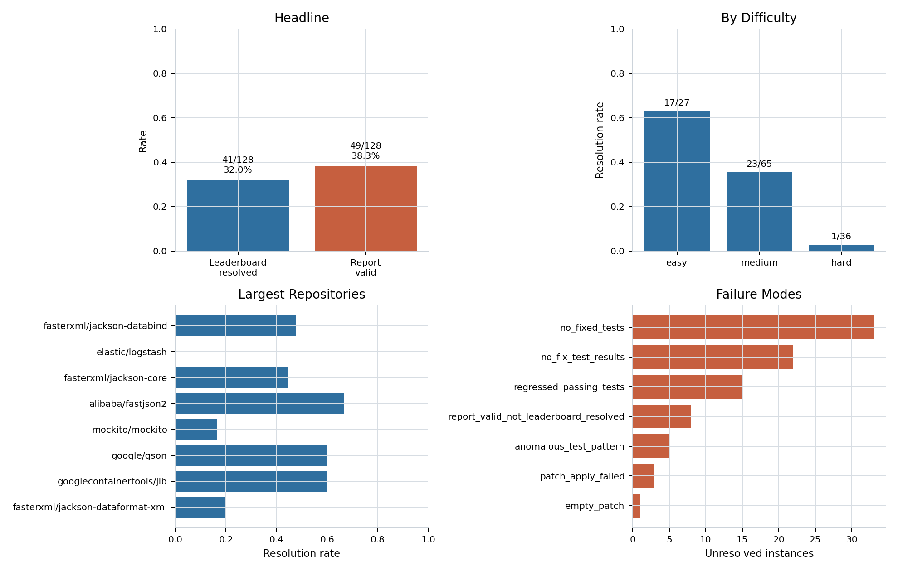
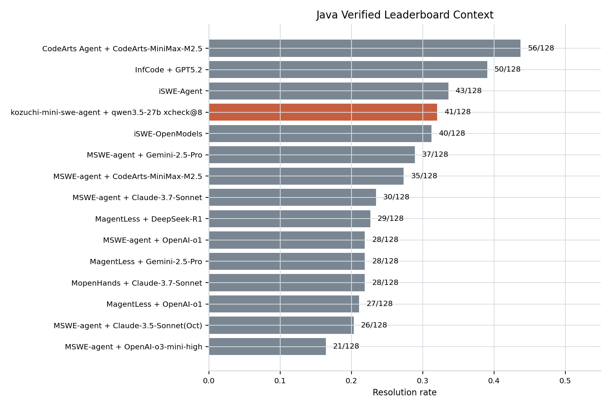
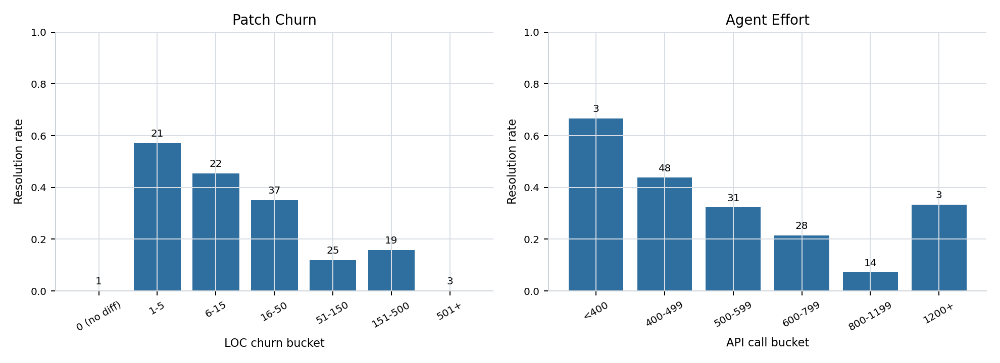

# Multi-SWE Java Analysis

Generated: 2026-04-29 01:36 UTC

## Headline

- Leaderboard result: 41/128 = 32.03%.
- Report-valid count: 49/128 = 38.28%.
- Full trajectory coverage: 127/128 = 99.22%.
- Leaderboard rank among local Java verified entries: 4.

## Difficulty

- medium: 23/65 = 35.38%.
- hard: 1/36 = 2.78%.
- easy: 17/27 = 62.96%.

## Top Failure Modes

- no_fixed_tests: 33 unresolved (37.9%).
- no_fix_test_results: 22 unresolved (25.3%).
- regressed_passing_tests: 15 unresolved (17.2%).
- report_valid_not_leaderboard_resolved: 8 unresolved (9.2%).
- anomalous_test_pattern: 5 unresolved (5.7%).
- patch_apply_failed: 3 unresolved (3.4%).

## Figures

## CSV Outputs

- [by_difficulty.csv](csv/by_difficulty.csv)
- [by_repo.csv](csv/by_repo.csv)
- [competitors_resolved.csv](csv/competitors_resolved.csv)
- [competitors_summary.csv](csv/competitors_summary.csv)
- [effort_buckets.csv](csv/effort_buckets.csv)
- [effort_resolution_corr.csv](csv/effort_resolution_corr.csv)
- [failure_mode_per_instance.csv](csv/failure_mode_per_instance.csv)
- [failure_modes.csv](csv/failure_modes.csv)
- [failure_modes_by_repo.csv](csv/failure_modes_by_repo.csv)
- [headline.csv](csv/headline.csv)
- [instance_solve_counts.csv](csv/instance_solve_counts.csv)
- [instances.csv](csv/instances.csv)
- [leaderboard.csv](csv/leaderboard.csv)
- [mcnemar.csv](csv/mcnemar.csv)
- [operational.csv](csv/operational.csv)
- [patch_apply_outcomes.csv](csv/patch_apply_outcomes.csv)
- [patch_by_difficulty.csv](csv/patch_by_difficulty.csv)
- [patch_files_buckets.csv](csv/patch_files_buckets.csv)
- [patch_repo_loc.csv](csv/patch_repo_loc.csv)
- [patch_size_buckets.csv](csv/patch_size_buckets.csv)
- [patch_summary.csv](csv/patch_summary.csv)
- [peers.csv](csv/peers.csv)
- [per_repo_vs_peers.csv](csv/per_repo_vs_peers.csv)
- [phase_by_outcome.csv](csv/phase_by_outcome.csv)
- [phase_distribution.csv](csv/phase_distribution.csv)
- [phase_giveup_rate.csv](csv/phase_giveup_rate.csv)
- [report_valid_vs_results.csv](csv/report_valid_vs_results.csv)
- [test_status_summary.csv](csv/test_status_summary.csv)
- [trajectory_stats.csv](csv/trajectory_stats.csv)
- [unique_resolved.csv](csv/unique_resolved.csv)

## Note

Some Multi-SWE per-instance reports are marked valid but are not counted as leaderboard resolved in results/results.json. The analysis keeps the leaderboard result as authoritative and exposes this mismatch in report_valid_vs_results.csv.
