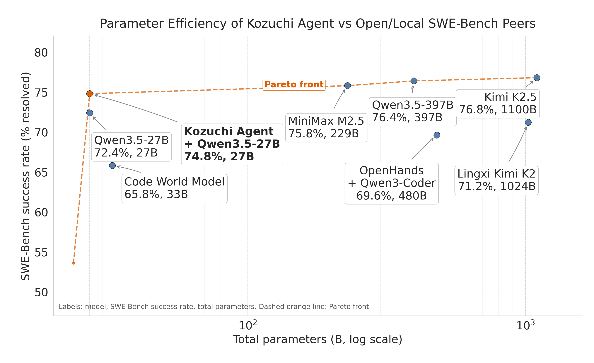
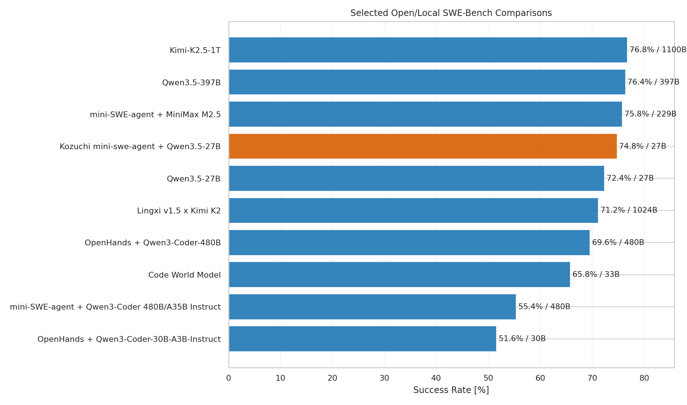
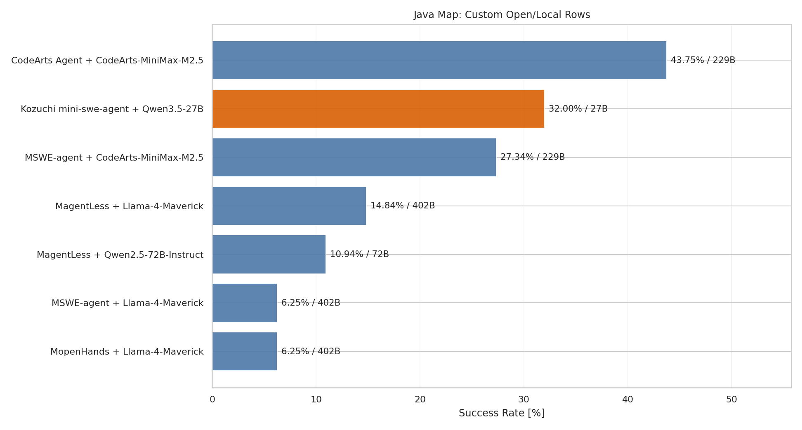
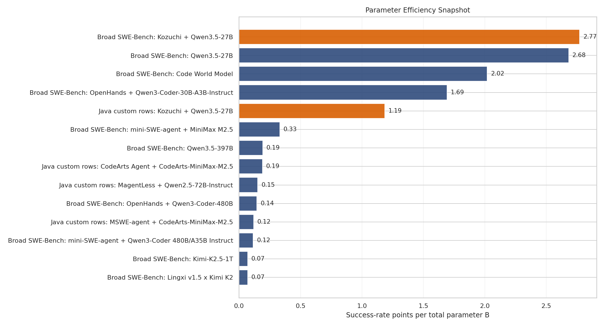

# SWE-Bench Comparison Analysis

Generated: 2026-04-29 20:00 UTC

Source workbook: `SWE-bench comparison.xlsx`

## Executive Takeaway

Kozuchi mini-SWE-agent + Qwen3.5-27B is the parameter-efficiency outlier in the broad SWE-Bench comparison: **74.8%** using a **27B** model. Against official leaderboard rows in the same sheet it would sit at about **rank 4 of 134** if inserted, and it is **rank 3 of 22** among open/local rows in the workbook snapshot.

The Java-specific map tells a different story: Kozuchi is **32.00%**, placing it second among the custom Java-row open/local comparisons in this workbook, behind CodeArts MiniMax M2.5. The Java result is therefore strong on efficiency but not yet the raw-success leader.

## Broad SWE-Bench Map

- Kozuchi improves over the base `Qwen3.5-27B` row by **+2.4 pp** with the same listed total parameter count.
- It beats `Code World Model` by **+9.0 pp** while using **27B vs 32.6B** total parameters.
- It trails much larger frontier open/local rows only slightly: **-1.6 pp** vs `Qwen3.5-397B`, **-2.0 pp** vs `Kimi-K2.5-1T`, and **-1.0 pp** vs `mini-SWE-agent + MiniMax M2.5`.
- Among rows with known total parameters, Kozuchi is **rank 1 of 20** by success-rate points per parameter B, and it is the top row among models with `params_total <= 50B`.

| Comparison | Peer Success | Peer Params | Kozuchi Delta | Peer / Kozuchi Params | Read |
| --- | --- | --- | --- | --- | --- |
| Base Qwen3.5-27B | 72.4% | 27.0B | +2.4 pp | 1.0x | Same 27B model family without the Kozuchi mini-SWE-agent wrapper. |
| Qwen3.5-397B | 76.4% | 397.0B | -1.6 pp | 14.7x | Much larger open/local model family. |
| Kimi-K2.5-1T | 76.8% | 1100.0B | -2.0 pp | 40.7x | Trillion-parameter frontier open/local peer. |
| MiniMax M2.5 | 75.8% | 229.0B | -1.0 pp | 8.5x | Strong mini-SWE-agent peer using a larger model. |
| Lingxi v1.5 x Kimi K2 | 71.2% | 1024.0B | +3.6 pp | 37.9x | Large Kimi-based agent snapshot. |
| OpenHands + Qwen3-Coder-480B | 69.6% | 480.0B | +5.2 pp | 17.8x | Official leaderboard-scale open/local agent. |
| Code World Model | 65.8% | 32.6B | +9.0 pp | 1.2x | Research open-weight coding model baseline. |

## Selected Open/Local Ranking

| Rank | Model | Success | Params | Efficiency |
| --- | --- | --- | --- | --- |
| 1 | Kimi-K2.5-1T | 76.8% | 1100.0B | 0.07 |
| 2 | Qwen3.5-397B | 76.4% | 397.0B | 0.19 |
| 3 | mini-SWE-agent + MiniMax M2.5 | 75.8% | 229.0B | 0.33 |
| 4 | Kozuchi mini-swe-agent + Qwen3.5-27B | 74.8% | 27.0B | 2.77 |
| 5 | Qwen3.5-27B | 72.4% | 27.0B | 2.68 |
| 6 | Lingxi v1.5 x Kimi K2 | 71.2% | 1024.0B | 0.07 |
| 7 | OpenHands + Qwen3-Coder-480B | 69.6% | 480.0B | 0.14 |
| 8 | Code World Model | 65.8% | 32.6B | 2.02 |
| 9 | mini-SWE-agent + Qwen3-Coder 480B/A35B Instruct | 55.4% | 480.0B | 0.12 |
| 10 | OpenHands + Qwen3-Coder-30B-A3B-Instruct | 51.6% | 30.5B | 1.69 |

## Java Map

Kozuchi's Java-row result is **32.00%**. It is **+4.66 pp** above the closest lower peer (`MSWE-agent + CodeArts-MiniMax-M2.5`) and **-11.75 pp** behind the custom-row leader (`CodeArts Agent + CodeArts-MiniMax-M2.5`). Because Kozuchi is listed at 27B and CodeArts MiniMax is listed at 229B, Kozuchi has a much stronger efficiency profile despite lower raw success.

| Comparison | Peer Success | Peer Params | Kozuchi Delta | Peer / Kozuchi Params | Read |
| --- | --- | --- | --- | --- | --- |
| CodeArts MiniMax M2.5 | 43.75% | 229.0B | -11.75 pp | 8.5x | Best custom Java-row result in this sheet. |
| MSWE CodeArts MiniMax M2.5 | 27.34% | 229.0B | +4.66 pp | 8.5x | Closest Java-row peer below Kozuchi. |
| MagentLess Llama-4-Maverick | 14.84% | 402.0B | +17.16 pp | 14.9x | Large-model Java-row baseline. |
| MagentLess Qwen2.5-72B | 10.94% | 72.0B | +21.06 pp | 2.7x | Medium-large Java-row baseline. |
| MSWE Llama-4-Maverick | 6.25% | 402.0B | +25.75 pp | 14.9x | Lowest custom Java-row baseline. |
| MopenHands Llama-4-Maverick | 6.25% | 402.0B | +25.75 pp | 14.9x | CWM-labeled Java-row baseline. |

## Java Custom-Row Ranking

| Rank | Model | Success | Params | Efficiency |
| --- | --- | --- | --- | --- |
| 1 | CodeArts Agent + CodeArts-MiniMax-M2.5 | 43.75% | 229.0B | 0.19 |
| 2 | Kozuchi mini-swe-agent + Qwen3.5-27B | 32.00% | 27.0B | 1.19 |
| 3 | MSWE-agent + CodeArts-MiniMax-M2.5 | 27.34% | 229.0B | 0.12 |
| 4 | MagentLess + Llama-4-Maverick | 14.84% | 402.0B | 0.04 |
| 5 | MagentLess + Qwen2.5-72B-Instruct | 10.94% | 72.0B | 0.15 |
| 6 | MSWE-agent + Llama-4-Maverick | 6.25% | 402.0B | 0.02 |
| 7 | MopenHands + Llama-4-Maverick | 6.25% | 402.0B | 0.02 |

## Data Quality Notes

- The mapped sheets contain official leaderboard rows and manually added non-leaderboard snapshot rows; rank statements above explicitly separate those cases.
- `Local LLM = O` is treated as open/local and `X` as non-local/proprietary, following the workbook labels.
- Some manually added Java rows appear to reuse model-family fields from the broad map; the report prioritizes the `Model (Coding Agent+LLM)`, success-rate, and total-parameter columns for comparisons.
- Parameter-efficiency uses listed total parameters, not activated parameters, because activated parameters are missing for several relevant 27B and Java rows.

## Plots






## Reproducibility

Regenerate this report and all plots with:

```bash
uv run paper/comparison/src/analyze_comparison.py
```
